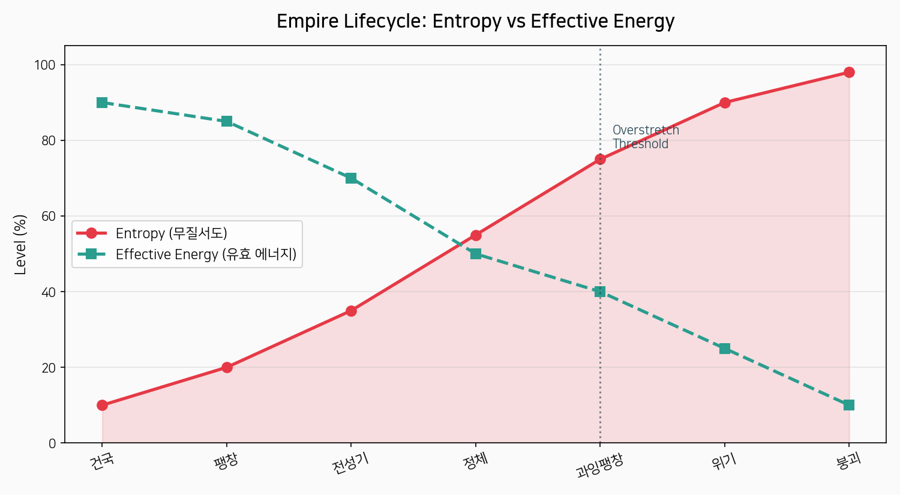
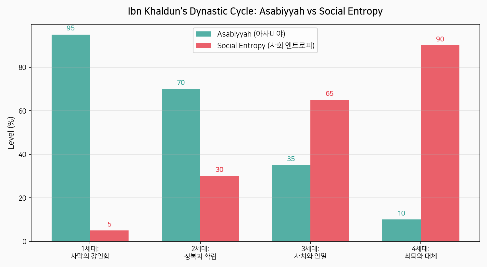
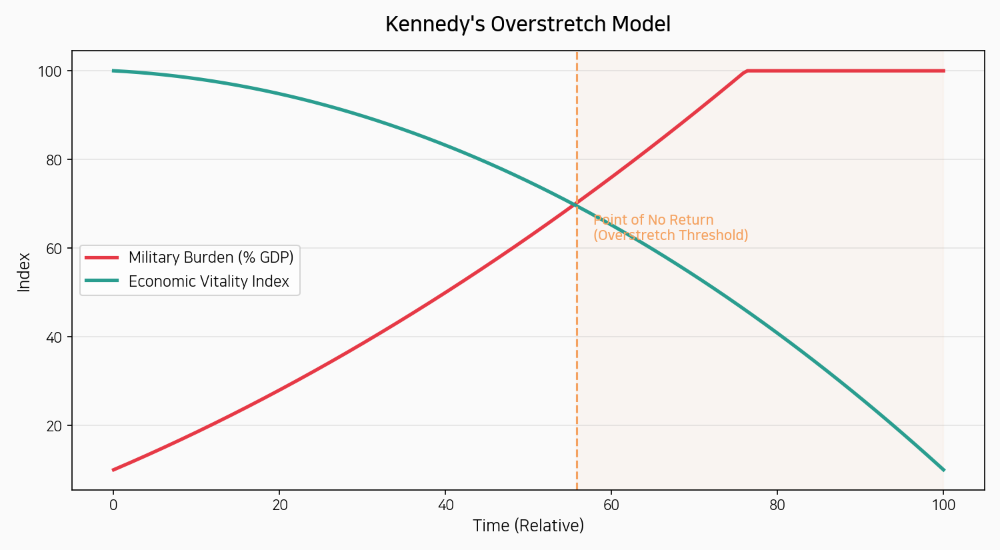
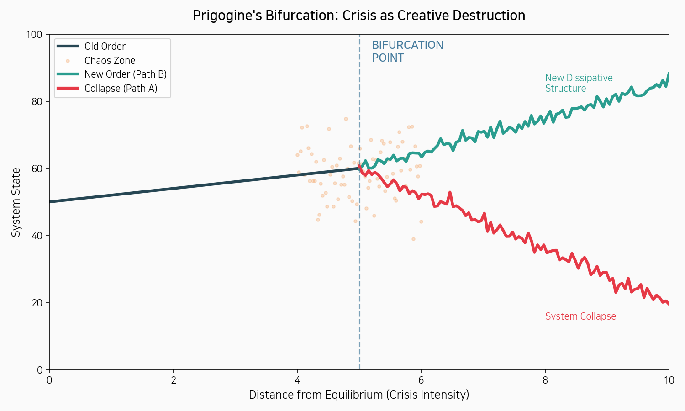
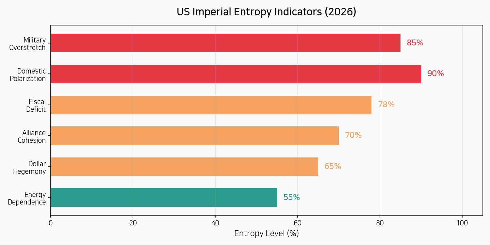
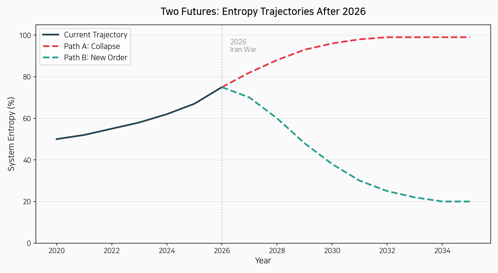

# 서론: 왜 열역학으로 제국을 읽는가

> *"우주의 엔트로피는 최대를 향해 증가한다."* — 루돌프 클라우지우스 (1865)

2026년 2월 28일, 미국은 이스라엘과 함께 이란에 대한 공습을 개시했다. 호르무즈 해협이 사실상 봉쇄되고, 원유 가격은 $126/배럴을 돌파했다. Carla Norrlof는 *Project Syndicate*에서 "미국 패권이 눈앞에서 무너지고 있다"고 선언했다. 이 광경 앞에서 우리는 묻는다: **제국의 붕괴는 필연적인가? 그렇다면 그 논리는 무엇인가?**

이 에세이는 물리학의 열역학 제2법칙과 프리고진의 산일구조 이론을 제국의 흥망과 교차시킨다. 이것은 단순한 비유가 아니라, **구조적 동형성(structural isomorphism)**에 대한 탐구다.

---

# 제1장: 엔트로피 — 무질서의 화살

## 열역학 제2법칙의 본질

열역학 제2법칙은 간단히 말하면 이것이다: **고립계에서 엔트로피(무질서도)는 항상 증가한다.** 뜨거운 커피는 식고, 깨진 유리는 스스로 붙지 않는다. 시간은 한 방향으로만 흐른다.

볼츠만은 이를 통계역학으로 정식화했다: **S = k ln W**. 여기서 W는 가능한 미시상태의 수다. 시스템이 커질수록 무질서한 배열이 질서정연한 배열보다 압도적으로 많아진다. **질서는 통계적으로 불리하다.**

## 사회적 엔트로피: 제국이라는 열역학 시스템

제국을 하나의 열역학 시스템으로 보면, 놀라운 대응관계가 드러난다:

- **에너지 투입** = 정복, 교역, 조세 수입
- **에너지 산일** = 관료제 유지, 군사비, 인프라
- **엔트로피 증가** = 관료제 비대화, 부패, 정보 과부하, 사회 분열

{width=100%}

로마 제국은 이 패턴의 교과서적 사례다. 3세기 위기에 이르러 관료제 유지비용이 세수를 초과하기 시작했다. 디오클레티아누스의 개혁은 일시적으로 엔트로피를 낮추었지만(외부 에너지 투입), 장기적 추세는 되돌릴 수 없었다.

---

# 제2장: 아사비야의 해체 — 이븐 할둔과 사회적 엔트로피

## 14세기의 열역학자

이븐 할둔(1332-1406)은 열역학을 몰랐지만, 그가 『무깟디마』에서 기술한 왕조 순환론은 엔트로피 법칙과 놀라울 정도로 정확하게 대응한다.

**아사비야(Asabiyyah)** — 집단 연대의식, 사회적 결속력. 이것이 바로 사회 시스템의 **네겐트로피(negentropy)**다.

{width=100%}

할둔의 핵심 통찰: **쇠퇴는 도덕적이 아니라 구조적이다.** 성공 자체가 규율과 연대를 해소시키는 조건을 만든다. 이것은 열역학의 언어로 완벽히 번역된다: **질서(아사비야)는 지속적 에너지 투입 없이는 유지될 수 없으며, 고립계는 필연적으로 무질서(엔트로피 최대)를 향한다.**

## 케네디의 과잉팽창: 열역학적 재해석

폴 케네디의 "제국적 과잉팽창"을 열역학으로 번역하면:

1. **군사비 증가** = 시스템 유지를 위한 에너지 소비 증가
2. **경제 성장 투자 감소** = 새로운 저(低)엔트로피 자원 확보 능력 감소
3. **하강 나선** = 엔트로피 증가의 자기강화 루프

케네디의 테제는 본질적으로 이것이다: **제국이 질서를 유지하기 위해 소비하는 에너지가 새로운 에너지를 확보하는 능력을 초과할 때, 시스템은 비가역적 쇠퇴에 진입한다.**

{width=100%}

---

# 제3장: 프리고진의 전환 — 혼돈 속의 질서

## 산일구조: 붕괴 너머의 물리학

여기서 이야기가 전환된다. 열역학 제2법칙이 붕괴의 불가피성을 말한다면, **프리고진의 산일구조 이론은 붕괴 이후의 창발을 말한다.**

프리고진의 핵심 발견: 평형에서 멀리 벗어난 **개방계**에서는 엔트로피 증가가 역설적으로 **새로운 질서의 탄생**으로 이어질 수 있다.

메커니즘:

1. 시스템이 평형에서 점점 멀어짐 (위기의 심화)
2. 작은 요동(fluctuation)이 증폭됨
3. **분기점(bifurcation point)**에 도달
4. 시스템이 완전히 새로운 질서 상태로 재조직화
5. 새로운 질서는 이전보다 **질적으로 다르고 더 복잡**

{width=100%}

## 전쟁은 분기점이다

모든 대규모 전쟁은 문명적 분기점으로 기능한다:

- **30년 전쟁 (1618-1648)** → 베스트팔렌 체제의 창발
- **나폴레옹 전쟁 (1803-1815)** → 빈 체제와 민족국가 질서
- **제1·2차 세계대전 (1914-1945)** → UN 체제와 미국 패권

이 각각의 경우에서, 기존 질서의 엔트로피가 임계점에 도달하고, 전쟁이라는 거대한 요동이 발생하며, 그 결과 이전과는 질적으로 다른 새로운 산일구조가 창발했다.

---

# 제4장: 2026년 — 우리는 분기점에 있는가?

## 미국 제국의 엔트로피 진단

현재 미국 시스템의 엔트로피 지표들:

{width=100%}

## 이란 전쟁: 케네디의 예언이 실현되는가

2026년 이란 전쟁은 케네디의 과잉팽창 테제가 실시간으로 전개되는 현장이다:

- **자원 소모**: 전략비축유 4억 배럴 방출 — 역대 최대
- **경제적 역풍**: 유가 $126/배럴, 스태그플레이션 리스크
- **동맹 이탈**: 유럽·아시아 파트너들의 이란전 불참
- **목표 미달성**: 2주 이상 지속에도 정권교체 목표 미달
- **기회비용**: 중국·러시아의 전략적 공백 활용

이븐 할둔의 렌즈로 보면: 미국의 아사비야(국내 결속력)는 극도의 정치적 양극화로 사실상 해체 상태다. 4세대 순환의 마지막 단계에 근접하고 있다.

## 그러나: 프리고진이 말하는 것

여기서 결정적인 구분이 필요하다. 열역학 제2법칙은 **고립계**에만 적용된다. 그러나 실제 문명은 **개방계**다. 프리고진의 이론이 중요한 이유가 여기에 있다.

현재의 위기는 두 가지 경로를 열어놓고 있다:

**경로 A — 붕괴**: 엔트로피 증가가 시스템의 자기조직화 능력을 초과. 로마 제국 패턴의 반복.

**경로 B — 새로운 산일구조**: 위기의 에너지가 완전히 새로운 국제질서의 창발로 이어짐. 다극체제, 지역 에너지 자립, 탈(脫)페트로달러 시스템.

{width=100%}

---

# 결론: 엔트로피는 운명이 아니다

이 에세이의 핵심 논지를 정리한다:

1. **구조적 동형성은 실재한다.** 열역학 제2법칙의 엔트로피 증가, 이븐 할둔의 아사비야 쇠퇴, 케네디의 과잉팽창은 동일한 구조적 패턴의 서로 다른 기술(記述)이다.

2. **2026년 이란 전쟁은 엔트로피 임계점의 징후다.** 군사적 과잉팽창, 경제적 역풍, 동맹 해체, 국내 분열 — 이 모든 것이 시스템의 엔트로피가 임계 수준에 도달했음을 가리킨다.

3. **그러나 프리고진이 보여주듯, 위기는 곧 기회다.** 분기점에서 시스템은 붕괴할 수도 있지만, 질적으로 새로운 질서로 도약할 수도 있다. 이것이 열역학이 결정론적 비관주의에 빠지지 않는 이유다.

4. **핵심 변수는 '개방성'이다.** 고립계는 엔트로피 증가를 피할 수 없다. 그러나 개방계는 외부와의 에너지 교환을 통해 새로운 산일구조를 창출할 수 있다. 미국(그리고 세계 시스템)이 폐쇄적 자기이익에 갇히느냐, 새로운 형태의 협력과 교환을 여느냐가 분기점의 방향을 결정할 것이다.

열역학은 제국의 몰락이 불가피하다고 말하지 않는다. 다만 **질서를 유지하려면 끊임없는 에너지 투입과 개방성이 필요하다**고 말한다. 엔트로피는 운명이 아니라 경고다.

---

*이 보고서는 Insight Lab Week 2 리서치의 일환으로 작성되었습니다.*

## 참고 문헌

- Prigogine, I. & Stengers, I. (1984). *Order Out of Chaos: Man's New Dialogue with Nature*
- Kennedy, P. (1987). *The Rise and Fall of the Great Powers*
- Ibn Khaldun (1377). *Muqaddimah (서론)*
- Rifkin, J. (1980). *Entropy: A New World View*
- Norrlof, C. (2026). "American Hegemony Is Collapsing Before Our Eyes." *Project Syndicate*
- Atlas Institute (2026). "Echoes of Empire: The 2026 US-Israel-Iran War"
- Eurasia Review (2026). "The Fault Lines Of A New Middle East"
- Dallas Fed (2026). "What the closure of the Strait of Hormuz means"
- Asia Times (2026). "Iran may be where the US-led world order ends"
- ScheerPost (2026). "The Empire Is Shaking"
