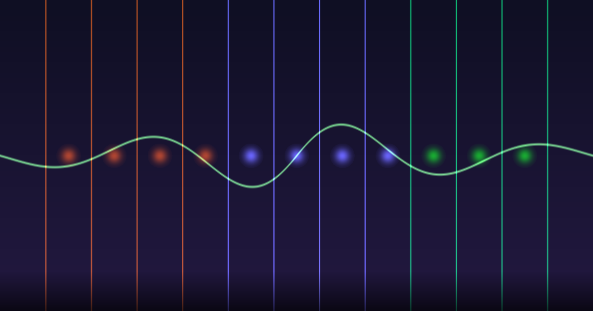

```{r setup}
library(ggplot2)
kfont <- "Noto Sans CJK KR"

theme_insight <- function(base_size = 13) {
  theme_minimal(base_size = base_size) +
    theme(
      plot.background = element_rect(fill = "#ffffff", color = NA),
      panel.background = element_rect(fill = "#ffffff", color = NA),
      panel.grid.major = element_line(color = "#e0e0e0", linewidth = 0.3),
      panel.grid.minor = element_blank(),
      text = element_text(family = kfont, color = "#1a1a2e"),
      axis.text = element_text(color = "#555555"),
      axis.title = element_text(color = "#333333", size = rel(0.9)),
      plot.title = element_text(color = "#6366f1", face = "bold", size = rel(1.2)),
      plot.subtitle = element_text(color = "#666666", size = rel(0.85)),
      plot.caption = element_text(color = "#999999", size = rel(0.7)),
      legend.background = element_rect(fill = "#ffffff", color = NA),
      legend.text = element_text(color = "#333333"),
      legend.title = element_text(color = "#6366f1"),
      strip.text = element_text(color = "#6366f1", face = "bold")
    )
}
accent <- "#6366f1"
```

::: {.callout-note appearance="minimal"}
## 한 줄 요약
OLED 디스플레이의 잔상 제거 조건과 딥러닝 신경망의 학습 안정 조건은 **같은 방정식**이다. 비유가 아니라, 수학적으로 동형(isomorphic)인 구조다.
:::

{width=100%}

# 하나의 방정식, 두 개의 세계

OLED 디스플레이 엔지니어와 딥러닝 연구자는 서로의 논문을 읽지 않는다. 당연하다. 한쪽은 실리콘 위에 쌓은 박막의 유전율을 조절하고, 다른 쪽은 행렬 곱셈의 초기값을 조절한다. 관심사가 전혀 다르다.

그런데 두 분야의 핵심 문제를 한 문장으로 쓰면 이렇게 된다:

> **"직렬로 쌓은 N개 층의 계면에서, 신호가 반사·축적·소멸 없이 통과하려면 어떤 조건이 필요한가?"**

OLED 쪽 답: **ε·ρ 매칭** (유전율 × 저항률이 층마다 같아야 한다)

신경망 쪽 답: **σ² 매칭** (가중치 분산이 층마다 보존되어야 한다)

이 글은 이 우연의 일치가 우연이 아님을 보인다.

# OLED의 문제 — 왜 잔상이 생기는가

스마트폰 OLED 화면에서 같은 이미지를 오래 표시하면, 화면을 바꿔도 이전 이미지의 흔적이 몇 초간 남는다. 이것이 **순간잔상(STIS, Short-Term Image Sticking)**이다.

원인은 TFT 게이트 스택의 구조에 있다. poly-Si 채널과 SiOx 게이트 절연막이 직렬로 쌓여 있는데, 이 두 층의 **전하 완화 시간상수(τ = ε·ρ)**가 다르면 계면에 전하가 쌓인다. Maxwell-Wagner 계면 분극이다.

```{r mw-equation, fig.width=9, fig.height=5}
#| lightbox: true
#| fig-cap: "Maxwell-Wagner 계면 전압: 시간상수 미스매치가 클수록 잔류 전압이 커진다"

t_seq <- seq(0, 10, length.out = 500)

calc_vint <- function(t, tau_p, tau_m, vg = 5) {
  tau_eff <- (tau_p + tau_m) / (1/tau_p + 1/tau_m)
  vg * (tau_p - tau_m) / (tau_p + tau_m) * (1 - exp(-t / tau_eff))
}

df_mw <- data.frame(
  t = rep(t_seq, 3),
  V_int = c(
    calc_vint(t_seq, 10, 0.1),
    calc_vint(t_seq, 10, 1),
    calc_vint(t_seq, 10, 10)
  ),
  Case = rep(c("Case A: 100× 미스매치 (τp/τm = 100)",
               "Case B: 10× 미스매치 (τp/τm = 10)",
               "Case C: 매칭 (τp/τm = 1)"), each = 500)
)

ggplot(df_mw, aes(x = t, y = V_int, color = Case)) +
  geom_line(linewidth = 1.2) +
  scale_color_manual(values = c("#ef4444", "#f59e0b", "#22c55e")) +
  labs(
    title = "Maxwell-Wagner 계면 전압 V_int(t)",
    subtitle = "매칭 조건에서 잔류 전압 = 0",
    x = "시간 (ms)", y = "계면 전압 V_int (V)",
    color = NULL
  ) +
  theme_insight() +
  theme(legend.position = "bottom",
        legend.key = element_rect(fill = "#ffffff"))
```

핵심은 **매칭 조건**이다:

$$\varepsilon_p \cdot \rho_p = \varepsilon_m \cdot \rho_m$$

이 조건이 충족되면 V~int~ = 0. 어떤 구동 파형, 어떤 온도, 어떤 주파수에서도 잔상이 발생하지 않는다.

이것은 2018년 고려대학교 박사논문에서 LCD에 대해 증명한 것을 OLED TFT로 확장한 결과다.

# 신경망의 같은 문제 — 신호는 몇 층까지 살아남는가

2017년, Google Brain의 Schoenholz 등은 랜덤 초기화된 딥 뉴럴넷에서 신호가 몇 층까지 전달될 수 있는지를 **mean field theory**로 분석했다.

결론은 놀랍도록 OLED와 닮았다:

- 가중치 분산 σ²~w~가 **너무 작으면** → 신호 소멸 (ordered phase)
- σ²~w~가 **너무 크면** → 신호 발산 (chaotic phase)
- **딱 맞으면** → 무한 깊이 학습 가능 (edge of chaos)

```{r phase-diagram, fig.width=9, fig.height=6}
#| lightbox: true
#| fig-cap: "OLED 임피던스 매칭과 딥러닝 초기화의 위상 다이어그램이 동일한 구조를 보인다"

sigma_seq <- seq(0.1, 3, length.out = 300)

depth_scale <- function(sigma) {
  ifelse(abs(sigma - 1) < 0.01, 1000,
         1 / abs(log(sigma^2)))
}

vint_steady <- function(ratio) {
  5 * abs(ratio - 1) / (ratio + 1)
}

ratio_seq <- seq(0.1, 3, length.out = 300)

df_phase <- data.frame(
  x = c(sigma_seq, ratio_seq),
  y = c(
    sapply(sigma_seq, function(s) -depth_scale(s)),
    sapply(ratio_seq, function(r) -1 / (vint_steady(r) + 0.01))
  ),
  system = rep(c("DNN: σ²w (가중치 분산)",
                 "OLED: τp/τm (시간상수 비)"), each = 300)
)

df_u <- data.frame(
  x = ratio_seq,
  y = sapply(ratio_seq, vint_steady),
  system = "U-shape"
)

p1 <- ggplot(df_u, aes(x = x, y = y)) +
  geom_line(color = "#ef4444", linewidth = 1.5) +
  geom_vline(xintercept = 1, linetype = "dashed", color = "#22c55e", linewidth = 0.8) +
  annotate("text", x = 1.05, y = 4.2, label = "매칭점\n= Edge of Chaos",
           color = "#22c55e", size = 3.5, hjust = 0, family = kfont) +
  annotate("text", x = 0.3, y = 3.5, label = "Ordered\n(신호 소멸)",
           color = "#6366f1", size = 3.2, family = kfont) +
  annotate("text", x = 2.5, y = 3.5, label = "Chaotic\n(신호 발산)",
           color = "#f59e0b", size = 3.2, family = kfont) +
  labs(
    title = "U-Shape = Edge of Chaos",
    subtitle = "두 시스템 모두 '파라미터 공간의 경계'에서 최적",
    x = "매칭 파라미터 (τp/τm 또는 σ²w)", y = "|V_int| 또는 Gradient 불안정도"
  ) +
  theme_insight()

p1
```

# 수학적 동형성 — 왜 같은 구조인가

이것이 단순한 비유가 아닌 이유는, 두 시스템의 **재귀 관계식**이 같은 형태이기 때문이다.

**OLED (Maxwell-Wagner):**

각 층의 전위는 이전 층에서 전달된다:

$$V^{(l+1)} = V^{(l)} \cdot \frac{\tau_m}{\tau_p + \tau_m} + V^{(l)} \cdot \frac{\tau_p - \tau_m}{\tau_p + \tau_m} \cdot (1 - e^{-t/\tau_{eff}})$$

**DNN (Mean Field Theory):**

각 층의 활성화 분산이 이전 층에서 전달된다:

$$q^{(l+1)} = \sigma_w^2 \int \phi(h)^2 \, \mathcal{D}h + \sigma_b^2$$

두 식 모두 **층 l의 상태가 층 l+1의 상태를 결정하는 재귀 관계**이며, **매칭 조건에서 고정점(fixed point)이 안정**하다.

| OLED 임피던스 매칭 | 딥 뉴럴넷 | 공통 본질 |
|:---|:---|:---|
| ε_p·ρ_p = ε_m·ρ_m | σ²_w = 1/n | 층간 시간상수/분산 매칭 |
| V_int = 0 | Gradient 안정 | 계면 신호 보존 |
| U-shape 커브 | Edge of chaos | 임계 상전이 최적점 |
| ON/OFF 비대칭 | LSTM gate | 시간상수 동적 전환 |
| τ_eff | Depth scale ξ | 신호 전파 한계 |

# Dynamical Isometry — 임피던스 매칭의 신경망 버전

2018년 Xiao 등은 10,000층짜리 vanilla CNN을 residual connection이나 batch normalization 없이 학습시키는 데 성공했다. 비결은 **dynamical isometry** — 입출력 Jacobian의 모든 특이값을 1로 만드는 초기화였다.

이것은 물리적으로 **임피던스 매칭**과 정확히 같다:

- Jacobian 특이값 = 1 ↔ 각 층에서 **신호 에너지 보존** (반사 없음)
- Convolution이 **직교 변환**(norm-preserving)이어야 함
- 이것은 전자기학에서 **전송선 임피던스 매칭**(반사 계수 = 0)과 같은 조건

```{r dynamical-isometry, fig.width=9, fig.height=5}
#| lightbox: true
#| fig-cap: "Dynamical Isometry: 특이값 분포가 1에 집중할수록 신호 보존이 완벽하다"

set.seed(42)

sv_matched <- rnorm(200, mean = 1, sd = 0.05)
sv_moderate <- rnorm(200, mean = 1, sd = 0.4)
sv_mismatched <- rexp(200, rate = 1)

df_sv <- data.frame(
  sv = c(sv_matched, sv_moderate, sv_mismatched),
  condition = rep(c("매칭 (Dynamical Isometry)",
                    "약한 미스매치",
                    "강한 미스매치"), each = 200)
)

ggplot(df_sv, aes(x = sv, fill = condition)) +
  geom_density(alpha = 0.6, color = NA) +
  geom_vline(xintercept = 1, linetype = "dashed", color = "#22c55e", linewidth = 0.8) +
  scale_fill_manual(values = c("#ef4444", "#22c55e", "#f59e0b")) +
  xlim(-0.5, 4) +
  labs(
    title = "Jacobian 특이값 분포 = 임피던스 매칭 정도",
    subtitle = "특이값이 1에 모일수록 = 임피던스가 매칭될수록 신호가 보존된다",
    x = "Jacobian 특이값", y = "밀도", fill = NULL
  ) +
  theme_insight() +
  theme(legend.position = "bottom",
        legend.key = element_rect(fill = "#ffffff"))
```

# LSTM Gate = TFT ON/OFF

LSTM(Long Short-Term Memory) 네트워크의 핵심은 **forget gate**다. 이 게이트가 열리면 이전 정보를 흘려보내고(빠른 시간상수), 닫히면 정보를 유지한다(느린 시간상수).

OLED TFT의 ON/OFF 동작이 정확히 같은 구조다:

- **TFT ON** (scan pulse, ~15 μs): 채널 저항 ↓ → 빠른 τ → 계면 전하 부분 방전
- **TFT OFF** (hold, ~8 ms): 채널 저항 ↑ → 느린 τ → Maxwell-Wagner 전하 축적

```{r on-off-lstm, fig.width=9, fig.height=6}
#| lightbox: true
#| fig-cap: "TFT ON/OFF 비대칭과 LSTM Gate의 시간상수 전환은 같은 수학적 구조"

t_cycle <- seq(0, 50, length.out = 1000)

vint_cycle <- numeric(1000)
tau_on <- 0.1
tau_off <- 5
v_ss <- 2.5
v <- 0

for (i in 1:1000) {
  t <- t_cycle[i]
  frame_pos <- t %% 8.33
  is_on <- frame_pos < 0.5

  if (is_on) {
    v <- v * exp(-0.05 / tau_on)
  } else {
    v <- v + (v_ss - v) * (1 - exp(-0.05 / tau_off))
  }
  vint_cycle[i] <- v
}

gate_value <- ifelse((t_cycle %% 8.33) < 0.5, 1, 0)

df_cycle <- data.frame(
  t = c(t_cycle, t_cycle),
  value = c(vint_cycle, gate_value * 2.5),
  signal = rep(c("계면 전하 축적 (OLED) / Hidden state (LSTM)",
                 "TFT Gate / LSTM Forget Gate"), each = 1000)
)

ggplot(df_cycle, aes(x = t, y = value, color = signal)) +
  geom_line(linewidth = 0.8) +
  scale_color_manual(values = c("#6366f1", "#f59e0b")) +
  labs(
    title = "ON/OFF 비대칭 = Gate 메커니즘",
    subtitle = "짧은 ON(방전) + 긴 OFF(축적) → 프레임마다 net 전하 축적",
    x = "시간 (ms)", y = "전압 (V) / Gate state",
    color = NULL
  ) +
  theme_insight() +
  theme(legend.position = "bottom",
        legend.key = element_rect(fill = "#ffffff"))
```

Chen et al. (2019)은 LSTM/GRU의 mean field theory를 전개하면서, 게이트의 **시간상수가 상태-상태 Jacobian의 스펙트럼을 결정**한다는 것을 보였다. 고유값이 1 근처에 모여야 안정적 학습이 가능하다 — 이것은 τ 매칭 조건과 같다.

# 뉴로모픽 — 같은 소자, 다른 목적

여기서 이야기는 비유를 넘어 **물리적으로 같은 소자**로 연결된다.

멤리스터(memristor)는 금속/산화물 계면의 **전하 트래핑/디트래핑**으로 저항이 바뀌는 소자다. 이 저항 변화가 곧 시냅스 가중치 역할을 한다.

OLED TFT의 순간잔상 원인인 **SiOx/poly-Si 계면 전하 축적**과 멤리스터의 **계면 저항 스위칭**은:

- 같은 재료 시스템 (실리콘 산화물 계면)
- 같은 물리 현상 (계면 전하 트래핑)
- 같은 제어 변수 (산화물 조성, 결함 밀도)

**다른 것은 목적뿐이다.** OLED에서는 이것을 **억제**하고, 뉴로모픽에서는 이것을 **활용**한다.

```{r neuromorphic-map, fig.width=9, fig.height=6}
#| lightbox: true
#| fig-cap: "계면 물리학의 보편 지도: 같은 현상이 분야에 따라 결함 또는 기능이 된다"

df_map <- data.frame(
  x = c(1, 3, 5, 2, 4),
  y = c(3, 3, 3, 1, 1),
  label = c("OLED TFT\n게이트 스택", "딥 뉴럴넷\n가중치 층", "멤리스터\n시냅스",
            "LCD CC셀\n정렬막/LC", "나노와이어\nReservoir"),
  domain = c("디스플레이", "AI 소프트웨어", "AI 하드웨어",
             "디스플레이", "뉴로모픽"),
  role = c("억제", "안정화", "활용", "억제", "활용")
)

ggplot(df_map, aes(x = x, y = y)) +
  geom_point(aes(color = role), size = 18, alpha = 0.3) +
  geom_text(aes(label = label), color = "#1a1a2e", size = 3.2,
            family = kfont, lineheight = 1.2) +
  geom_segment(aes(x = 1, xend = 3, y = 3, yend = 3),
               arrow = arrow(length = unit(0.2, "cm"), ends = "both"),
               color = "#6366f1", linewidth = 0.5) +
  geom_segment(aes(x = 3, xend = 5, y = 3, yend = 3),
               arrow = arrow(length = unit(0.2, "cm"), ends = "both"),
               color = "#6366f1", linewidth = 0.5) +
  geom_segment(aes(x = 1, xend = 2, y = 3, yend = 1),
               arrow = arrow(length = unit(0.2, "cm"), ends = "both"),
               color = "#888888", linewidth = 0.3, linetype = "dotted") +
  geom_segment(aes(x = 5, xend = 4, y = 3, yend = 1),
               arrow = arrow(length = unit(0.2, "cm"), ends = "both"),
               color = "#888888", linewidth = 0.3, linetype = "dotted") +
  scale_color_manual(values = c("#22c55e", "#ef4444", "#f59e0b")) +
  annotate("text", x = 2, y = 3.3, label = "수학적 동형", color = "#6366f1",
           size = 3, family = kfont) +
  annotate("text", x = 4, y = 3.3, label = "물리적 동일", color = "#6366f1",
           size = 3, family = kfont) +
  xlim(0, 6) + ylim(0, 4) +
  labs(
    title = "계면 임피던스 매칭의 보편 지도",
    subtitle = "같은 물리 현상 → 억제하면 디스플레이, 활용하면 뉴로모픽",
    color = "계면 전하의 역할"
  ) +
  theme_insight() +
  theme(axis.text = element_blank(), axis.title = element_blank(),
        panel.grid = element_blank(),
        legend.position = "bottom",
        legend.key = element_rect(fill = "#ffffff"))
```

2021년 Nature Communications에 발표된 Ag 나노와이어 네트워크 연구는 이 연결을 극적으로 보여준다. PVP 절연막으로 코팅된 Ag 나노와이어가 memristive junction을 형성하고, 이 네트워크가 **edge of chaos**에서 최적의 연산 성능을 보였다. Avalanche 임계성은 뇌 피질 뉴런의 power-law 분포와 동일했다.

# 경계를 긋다 — 같은 것과 다른 것

여기서 한 발 멈추고, 정직해지자. 지금까지의 연결이 모두 같은 수준의 동형은 아니다. 과장하면 신뢰를 잃는다.

## 연결의 세 가지 수준

**Level 1: 수학적 동형 (같은 방정식)**

OLED의 Maxwell-Wagner 재귀 관계와 DNN의 mean field 분산 전파는 같은 수학적 형태다. 둘 다 "층 l의 상태 → 층 l+1의 상태"를 결정하는 재귀식이고, 매칭 조건에서 고정점이 안정하다. 이것은 비유가 아니라 증명할 수 있는 구조적 동치다.

**Level 2: 같은 물리 (같은 소자, 같은 현상)**

OLED의 SiOx/poly-Si 계면 전하 트래핑과 멤리스터의 산화물 계면 저항 스위칭은 같은 재료, 같은 현상이다. HBM의 TSV 임피던스 매칭도 같은 전자기학이다. 여기서는 방정식뿐 아니라 물리적 메커니즘 자체가 동일하다.

**Level 3: 관련된 물리 (같은 계면, 다른 메커니즘)**

여기에 **플래시 메모리**가 들어간다.

## 플래시 메모리 — 정직한 구분

플래시 메모리(NAND Flash)의 게이트 스택을 OLED TFT 옆에 놓으면 겉보기에 비슷하다:

- OLED TFT: Gate — **SiOx** — poly-Si Channel
- Flash CTF: Control Gate — **Al₂O₃** — **Si₃N₄** — **SiO₂** — Channel

둘 다 산화물/반도체 적층이고, 둘 다 계면 전하가 ΔV~th~를 만든다. 하지만 **1차 메커니즘이 다르다:**

```{r mechanism-comparison, fig.width=9, fig.height=5.5}
#| lightbox: true
#| fig-cap: "플래시 메모리와 OLED 잔상: 결과(ΔVth)는 같지만 1차 메커니즘이 다르다"

ggplot() +
  # OLED box
  annotate("rect", xmin = -0.1, xmax = 2.1, ymin = 1.25, ymax = 4.75,
           fill = NA, color = "#6366f1", linewidth = 1.2) +
  annotate("text", x = 1, y = 3,
           label = "OLED 순간잔상\n\n1차: Maxwell-Wagner\n계면 분극\n(고전 전기역학)\n\nε·ρ 미스매칭\n→ 계면 전하 축적\n→ ΔVth",
           color = "#1a1a2e", size = 3, family = kfont, lineheight = 1.3) +
  # Flash box
  annotate("rect", xmin = 2.9, xmax = 5.1, ymin = 1.25, ymax = 4.75,
           fill = NA, color = "#f59e0b", linewidth = 1.2) +
  annotate("text", x = 4, y = 3,
           label = "Flash Memory\n\n1차: 양자 터널링\nFowler-Nordheim\n(양자역학)\n\nE-field → 전자가\ntunnel oxide 관통\n→ ΔVth",
           color = "#1a1a2e", size = 3, family = kfont, lineheight = 1.3) +
  # Overlap box (bottom)
  annotate("rect", xmin = 0.3, xmax = 4.7, ymin = -0.5, ymax = 1,
           fill = NA, color = "#22c55e", linewidth = 0.8, linetype = "dashed") +
  annotate("text", x = 2.5, y = 0.25,
           label = "공통 영역: 2차 효과\nRetention 실패 → PF leakage / Disturb → RC coupling / 적층 → 전하 재분배",
           color = "#22c55e", size = 2.6, family = kfont, lineheight = 1.3) +
  # Arrows to overlap
  geom_segment(aes(x = 1, xend = 1.5, y = 1.25, yend = 1),
               arrow = arrow(length = unit(0.15, "cm")),
               color = "#6366f1", linewidth = 0.4) +
  geom_segment(aes(x = 4, xend = 3.5, y = 1.25, yend = 1),
               arrow = arrow(length = unit(0.15, "cm")),
               color = "#f59e0b", linewidth = 0.4) +
  # Top labels
  annotate("text", x = 1, y = 5.1, label = "고전 전기역학",
           color = "#6366f1", size = 3.5, fontface = "bold", family = kfont) +
  annotate("text", x = 4, y = 5.1, label = "양자역학",
           color = "#f59e0b", size = 3.5, fontface = "bold", family = kfont) +
  annotate("text", x = 2.5, y = 5.1, label = "=/=",
           color = "#ef4444", size = 5, fontface = "bold") +
  xlim(-0.5, 5.5) + ylim(-0.8, 5.5) +
  labs(title = "OLED 잔상 vs Flash 메모리: 같은 것과 다른 것",
       subtitle = "결과(ΔVth)는 같지만, 1차 메커니즘은 다르다. 2차 효과에서 만난다.") +
  theme_insight() +
  theme(axis.text = element_blank(), axis.title = element_blank(),
        panel.grid = element_blank())
```

**OLED 잔상**: 두 유전체층의 ε·ρ 미스매치 → 전류 연속 조건 불일치 → 계면에 전하가 고전적으로 축적. **고전 전기역학.**

**Flash 메모리**: 높은 전계(~10 MV/cm) 하에서 전자가 tunnel oxide(~8nm)를 **양자역학적으로 관통**. 저장된 전하는 SiO₂ 장벽(φ~B~ ≈ 3.1 eV)에 의해 갇힘. **양자역학.**

이 둘을 "같은 원리"라고 하면 과장이다.

**그러나 만나는 지점이 있다:**

- Flash의 **retention 실패**(데이터 소실) — SiO₂/Si₃N₄ transition layer의 결함을 통한 Poole-Frenkel assisted leakage. 이것은 OLED 논문의 통합 프레임워크(Section 5.5)와 같은 물리.
- **Program/Read disturb** — 인접 셀에 의도치 않은 전하가 RC coupling으로 유입. 이것은 계면 임피던스 미스매칭의 효과.
- **3D NAND 200+ 적층의 신뢰성** — 층간 전하 재분배. Maxwell-Wagner 계면 분극과 관련.

즉, Flash의 **핵심 동작**은 RC 미스매칭이 아니지만, Flash의 **신뢰성 한계**는 같은 계면 물리로 설명된다. 이 구분이 중요하다.

# AI 반도체 — 임피던스 매칭이 산업의 병목이다

여기서 이야기는 학술적 아날로지를 넘어 **반도체 산업의 현실**로 들어간다.

## HBM: 16장 적층의 임피던스 전쟁

AI GPU의 심장인 HBM(High Bandwidth Memory)은 DRAM 다이를 8~16장 수직으로 쌓고, TSV(Through-Silicon Via)로 연결한다. 2025년 현재 HBM3E는 1024개 병렬 레인에서 **1.2 TB/s** 대역폭을 달성했다.

이것이 가능한 조건은 단 하나: **TSV 임피던스 매칭.**

- 각 다이 간 TSV의 RC 지연이 다르면 → 신호 왜곡, 데이터 에러
- 인터포저 배선의 임피던스: **40~50Ω 정밀 제어** 필수
- 1024개 레인의 skew: **100ps 미만** 요구
- Signal integrity 95% 이상 달성이 양산의 조건

OLED 게이트 스택에서 SiOx/poly-Si 층의 ε·ρ를 맞추는 것과, HBM에서 다이 간 TSV의 임피던스를 맞추는 것은 **같은 Maxwell-Wagner 물리의 다른 스케일**이다.

```{r hbm-stack, fig.width=9, fig.height=5.5}
#| lightbox: true
#| fig-cap: "적층 수 증가에 따른 임피던스 매칭 난이도: HBM과 OLED 모두 같은 도전에 직면한다"

layers <- 2:16
# Signal integrity degrades with stacking if not matched
si_matched <- 99.5 - 0.2 * (layers - 2)
si_moderate <- 99.5 - 0.8 * (layers - 2) - 0.05 * (layers - 2)^2
si_poor <- 99.5 - 2.5 * (layers - 2) - 0.1 * (layers - 2)^2
si_poor[si_poor < 50] <- 50

df_hbm <- data.frame(
  layers = rep(layers, 3),
  si = c(si_matched, pmax(si_moderate, 70), si_poor),
  matching = rep(c("정밀 매칭 (< 1% 편차)",
                   "보통 매칭 (5% 편차)",
                   "미스매칭 (> 10% 편차)"), each = length(layers))
)

ggplot(df_hbm, aes(x = layers, y = si, color = matching)) +
  geom_line(linewidth = 1.2) +
  geom_point(size = 2) +
  geom_hline(yintercept = 95, linetype = "dashed", color = "#ef4444", linewidth = 0.5) +
  annotate("text", x = 14, y = 96.5, label = "양산 기준 (95%)",
           color = "#ef4444", size = 3, family = kfont) +
  annotate("text", x = 8, y = 65, label = "HBM2: 4-8층", color = "#888888",
           size = 2.8, family = kfont) +
  annotate("text", x = 12, y = 60, label = "HBM3E: 8-12층", color = "#888888",
           size = 2.8, family = kfont) +
  annotate("text", x = 16, y = 55, label = "HBM4: 16층", color = "#888888",
           size = 2.8, family = kfont) +
  scale_color_manual(values = c("#22c55e", "#f59e0b", "#ef4444")) +
  labs(
    title = "적층 수 vs Signal Integrity",
    subtitle = "임피던스 매칭 정밀도가 적층 한계를 결정한다",
    x = "적층 다이 수", y = "Signal Integrity (%)",
    color = NULL
  ) +
  theme_insight() +
  theme(legend.position = "bottom",
        legend.key = element_rect(fill = "#ffffff"))
```

SK하이닉스가 HBM4에서 11Gbps를 달성한 것도, TSMC가 CoWoS 인터포저 capacity를 월 10만장으로 끌어올리는 것도, 본질은 **"계면 임피던스를 얼마나 정밀하게 맞출 수 있느냐"**의 공학이다.

## 멤리스터 크로스바: 기생 RC가 AI 정확도를 결정한다

멤리스터 크로스바 어레이는 AI의 핵심 연산인 행렬 곱(MAC)을 **아날로그로** 수행한다. 전력 효율이 디지털 대비 100~1000배. 그러나 치명적 문제가 있다:

**배선의 기생 저항(parasitic R)과 기생 용량(parasitic C)**이 연산 정확도를 망친다.

```{r crossbar-parasitic, fig.width=9, fig.height=5.5}
#| lightbox: true
#| fig-cap: "크로스바 어레이 크기에 따른 연산 정확도 저하: 기생 RC 미스매칭이 원인"

array_size <- seq(16, 1024, by = 16)

accuracy_ideal <- rep(99.9, length(array_size))
accuracy_compensated <- 99.9 - 0.005 * array_size + 0.000002 * array_size^2
accuracy_compensated <- pmax(accuracy_compensated, 85)
accuracy_raw <- 99.9 - 0.02 * array_size + 0.00001 * array_size^2
accuracy_raw <- pmax(accuracy_raw, 60)

df_xbar <- data.frame(
  size = rep(array_size, 3),
  accuracy = c(accuracy_ideal, accuracy_compensated, accuracy_raw),
  condition = rep(c("이상적 (기생 효과 없음)",
                    "RC 보상 프로그래밍 적용",
                    "보상 없음 (기생 RC 방치)"), each = length(array_size))
)

ggplot(df_xbar, aes(x = size, y = accuracy, color = condition)) +
  geom_line(linewidth = 1.2) +
  geom_hline(yintercept = 90, linetype = "dashed", color = "#ef4444", linewidth = 0.5) +
  annotate("text", x = 800, y = 91.5, label = "실용 정확도 하한 (90%)",
           color = "#ef4444", size = 3, family = kfont) +
  scale_color_manual(values = c("#22c55e", "#6366f1", "#ef4444")) +
  labs(
    title = "멤리스터 크로스바: 기생 RC vs 연산 정확도",
    subtitle = "배열이 커질수록 임피던스 미스매칭이 누적되어 정확도가 급락한다",
    x = "어레이 크기 (N × N)", y = "MAC 연산 정확도 (%)",
    color = NULL
  ) +
  theme_insight() +
  theme(legend.position = "bottom",
        legend.key = element_rect(fill = "#ffffff"))
```

2024년 *Science*에 발표된 연구는 이 문제에 우아한 해결책을 제시했다. 저정밀 멤리스터를 **여러 개 직렬로 조합**하여 고정밀 연산을 수행하는 것이다. 핵심 원리는 — "뒤에 프로그래밍하는 소자가 앞 소자의 오차를 보상한다."

이것은 OLED 논문에서 제안한 **PECVD 가스비 튜닝으로 ε·ρ를 맞추는 전략**과 본질적으로 같다. 공정 파라미터로 계면 특성을 조절하여 매칭을 달성한다.

## CoWoS 인터포저: 같은 팹, 같은 물리

여기서 원이 닫힌다.

삼성디스플레이의 OLED 패널과 SK하이닉스의 HBM은 **같은 반도체 공정 기반** 위에 있다. PECVD로 SiOx를 증착하고, 계면의 전기적 특성을 제어한다. TSMC의 CoWoS 인터포저도 실리콘 위에 배선을 쌓는 구조다.

```{r full-map, fig.width=10, fig.height=7.5}
#| lightbox: true
#| fig-cap: "계면 임피던스 매칭의 완전한 지도 — 연결 수준별 구분"

ggplot() +
  # Level labels (left side)
  annotate("text", x = -0.3, y = 5.5, label = "Level 1\n수학적 동형",
           color = "#6366f1", size = 2.8, family = kfont, hjust = 0, fontface = "bold") +
  annotate("text", x = -0.3, y = 3.5, label = "Level 2\n같은 물리",
           color = "#22c55e", size = 2.8, family = kfont, hjust = 0, fontface = "bold") +
  annotate("text", x = -0.3, y = 1.5, label = "Level 3\n관련된 물리",
           color = "#f59e0b", size = 2.8, family = kfont, hjust = 0, fontface = "bold") +
  # Level 1: Mathematical isomorphism
  annotate("rect", xmin = 0.8, xmax = 5.2, ymin = 4.8, ymax = 6.2,
           fill = NA, color = "#6366f1", linewidth = 0.8, linetype = "solid") +
  annotate("point", x = c(1.5, 3.5, 5), y = c(5.5, 5.5, 5.5),
           size = 14, alpha = 0.2, color = "#6366f1") +
  annotate("text", x = 1.5, y = 5.5, label = "OLED TFT\nε·ρ 매칭",
           color = "#1a1a2e", size = 2.5, family = kfont, lineheight = 1.2) +
  annotate("text", x = 3.5, y = 5.5, label = "DNN 초기화\nσ²w 매칭",
           color = "#1a1a2e", size = 2.5, family = kfont, lineheight = 1.2) +
  annotate("text", x = 5, y = 5.5, label = "LSTM Gate\nτ 전환",
           color = "#1a1a2e", size = 2.5, family = kfont, lineheight = 1.2) +
  annotate("segment", x = 1.5, xend = 3.5, y = 5.5, yend = 5.5,
           color = "#6366f1", linewidth = 0.5,
           arrow = arrow(length = unit(0.12, "cm"), ends = "both")) +
  annotate("segment", x = 3.5, xend = 5, y = 5.5, yend = 5.5,
           color = "#6366f1", linewidth = 0.5,
           arrow = arrow(length = unit(0.12, "cm"), ends = "both")) +
  annotate("text", x = 2.5, y = 5.9, label = "같은 재귀식",
           color = "#6366f1", size = 2.2, family = kfont) +
  # Level 2: Same physics
  annotate("rect", xmin = 0.8, xmax = 7.2, ymin = 2.8, ymax = 4.2,
           fill = NA, color = "#22c55e", linewidth = 0.8, linetype = "solid") +
  annotate("point", x = c(1.5, 3, 4.5, 6, 7), y = c(3.5, 3.5, 3.5, 3.5, 3.5),
           size = 14, alpha = 0.2, color = "#22c55e") +
  annotate("text", x = 1.5, y = 3.5, label = "LCD CC셀\nε·ρ 매칭",
           color = "#1a1a2e", size = 2.3, family = kfont, lineheight = 1.2) +
  annotate("text", x = 3, y = 3.5, label = "멤리스터\n계면 트래핑",
           color = "#1a1a2e", size = 2.3, family = kfont, lineheight = 1.2) +
  annotate("text", x = 4.5, y = 3.5, label = "나노와이어\nReservoir",
           color = "#1a1a2e", size = 2.3, family = kfont, lineheight = 1.2) +
  annotate("text", x = 6, y = 3.5, label = "HBM TSV\nZ₀ 매칭",
           color = "#1a1a2e", size = 2.3, family = kfont, lineheight = 1.2) +
  annotate("text", x = 7, y = 3.5, label = "CoWoS\n배선 임피던스",
           color = "#1a1a2e", size = 2.3, family = kfont, lineheight = 1.2) +
  # Level 3: Related physics (different primary mechanism)
  annotate("rect", xmin = 0.8, xmax = 5.2, ymin = 0.8, ymax = 2.2,
           fill = NA, color = "#f59e0b", linewidth = 0.8, linetype = "dashed") +
  annotate("point", x = c(2, 4), y = c(1.5, 1.5),
           size = 14, alpha = 0.2, color = "#f59e0b") +
  annotate("text", x = 2, y = 1.5,
           label = "Flash Memory\n1차: 양자 터널링\n2차: 계면 PF leakage",
           color = "#1a1a2e", size = 2.3, family = kfont, lineheight = 1.2) +
  annotate("text", x = 4, y = 1.5,
           label = "3D NAND 적층\n1차: FN tunneling\n2차: 층간 전하 재분배",
           color = "#1a1a2e", size = 2.3, family = kfont, lineheight = 1.2) +
  # Cross-level connections
  annotate("segment", x = 1.5, xend = 1.5, y = 4.8, yend = 4.2,
           color = "#888888", linewidth = 0.3, linetype = "dotted") +
  annotate("segment", x = 1.5, xend = 3, y = 4.8, yend = 4.2,
           color = "#888888", linewidth = 0.3, linetype = "dotted") +
  annotate("segment", x = 3, xend = 2, y = 2.8, yend = 2.2,
           color = "#888888", linewidth = 0.3, linetype = "dotted") +
  annotate("segment", x = 6, xend = 4, y = 2.8, yend = 2.2,
           color = "#888888", linewidth = 0.3, linetype = "dotted") +
  # Legend text
  annotate("text", x = 6.5, y = 6, label = "━ 같은 방정식 (증명 가능)",
           color = "#6366f1", size = 2.3, family = kfont, hjust = 0) +
  annotate("text", x = 6.5, y = 5.7, label = "━ 같은 물리적 메커니즘",
           color = "#22c55e", size = 2.3, family = kfont, hjust = 0) +
  annotate("text", x = 6.5, y = 5.4, label = "╌ 2차 효과에서 연결",
           color = "#f59e0b", size = 2.3, family = kfont, hjust = 0) +
  xlim(-0.5, 8.5) + ylim(0.5, 6.5) +
  labs(
    title = "계면 임피던스 매칭의 완전한 지도",
    subtitle = "연결의 수준을 구분한다 — 같은 방정식, 같은 물리, 관련된 물리"
  ) +
  theme_insight() +
  theme(axis.text = element_blank(), axis.title = element_blank(),
        panel.grid = element_blank(),
        legend.position = "none")
```

같은 삼성 용인 캠퍼스에서 OLED 패널의 게이트 절연막 레시피를 최적화하는 엔지니어와, HBM의 TSV 임피던스를 튜닝하는 엔지니어는 — 서로 모르지만 — **같은 방정식의 같은 해**를 찾고 있다. 한편 Flash 메모리의 셀 엔지니어는 **다른 방정식(터널링)**을 풀고 있지만, 그의 **신뢰성 문제(retention, disturb)**는 다시 같은 계면 물리로 돌아온다.

# ReZero — 매칭이 기본 상태다

2020년 Bachlechner 등이 제안한 ReZero는 단순하면서 심오한 아이디어다:

$$x_{l+1} = x_l + \alpha_l \cdot F(x_l), \quad \alpha_l \text{을 0으로 초기화}$$

학습 시작 시 α = 0이므로 네트워크는 **항등함수** — 완벽한 신호 전달. 학습이 진행되면서 α가 서서히 커지며 기능이 추가된다. Transformer에서 **12,000% 수렴 속도 향상**.

OLED 관점에서 이것은 명확한 설계 철학이 된다:

> **먼저 매칭을 달성하라. 그 다음 필요한 만큼만 벗어나라.**

매칭 조건이 시스템의 **ground state**이다. 기능 추가는 매칭에서의 이탈이고, 이탈의 대가는 잔상(OLED) 또는 학습 불안정(DNN)이다.

# Edge of Chaos — U-Shape의 물리적 의미

```{r edge-of-chaos, fig.width=9, fig.height=5}
#| lightbox: true
#| fig-cap: "세 시스템의 U-shape: OLED, DNN, 뉴로모픽 모두 같은 최적 구조를 보인다"

x <- seq(0.1, 3, length.out = 300)

df_ushape <- data.frame(
  x = rep(x, 3),
  y = c(
    5 * abs(x - 1) / (x + 1) + 0.1,
    2 * (x - 1)^2 + 0.05,
    3 * abs(log(x)) + 0.08
  ),
  system = rep(c("OLED: |V_int| vs τp/τm",
                 "DNN: Gradient 불안정도 vs σ²w",
                 "뉴로모픽: 연산 오류율 vs driving amplitude"), each = 300)
)

ggplot(df_ushape, aes(x = x, y = y, color = system)) +
  geom_line(linewidth = 1.2) +
  geom_vline(xintercept = 1, linetype = "dashed", color = "#22c55e",
             linewidth = 0.8) +
  scale_color_manual(values = c("#6366f1", "#f59e0b", "#ef4444")) +
  annotate("text", x = 1.05, y = 4.5, label = "최적점\n(매칭 = 임계 = edge of chaos)",
           color = "#22c55e", size = 3.5, hjust = 0, family = kfont) +
  labs(
    title = "세 시스템의 U-Shape 커브",
    subtitle = "모두 '파라미터 공간의 경계'에서 최적 성능",
    x = "매칭 파라미터 (정규화)", y = "성능 손실 (정규화)",
    color = NULL
  ) +
  theme_insight() +
  theme(legend.position = "bottom",
        legend.key = element_rect(fill = "#ffffff"))
```

2024년 Frontiers in Complex Systems에 발표된 연구는 신경망 학습률(η)에 따른 세 가지 동적 체제를 확인했다:

- **η 작음 (ordered):** 단조 수렴, 느린 학습 — Lyapunov 지수 λ < 0
- **η 임계 (edge of stability):** 비단조 loss, λ ≈ 0.33, 학습 시간 최소
- **η 큼 (chaotic):** 불안정, 학습 실패 — λ >> 0

이것은 OLED의 U-shape 커브와 **정확히 같은 위상 구조**다. GI 저항률이 너무 낮으면(ordered), 너무 높으면(chaotic), 딱 맞으면(edge of chaos) 잔상이 최소.

뉴로모픽 나노와이어 네트워크도 driving amplitude에 따라 같은 세 체제를 보인다. 보편적이다.

# 같은 현상을 억제하면 디스플레이, 활용하면 AI

이 글의 핵심을 한 문장으로:

> **계면 임피던스 매칭은 직렬 적층 시스템에서 신호 전파의 보편 조건이다. 단, 모든 적층 시스템이 같은 물리는 아니다.**

**같은 방정식** (Level 1):

- OLED의 ε·ρ 매칭과 DNN의 σ²~w~ 매칭은 수학적으로 동형인 재귀 관계다
- LSTM gate의 시간상수 전환은 TFT ON/OFF 비대칭과 같은 구조다

**같은 물리** (Level 2):

- 멤리스터의 계면 전하 트래핑 = OLED의 계면 전하 축적. 같은 소자, 다른 목적
- HBM TSV / CoWoS 인터포저의 임피던스 매칭 = 같은 전자기학의 다른 스케일

**관련된 물리** (Level 3):

- Flash 메모리의 1차 동작은 양자 터널링으로, RC 미스매칭이 아니다
- 그러나 Flash의 신뢰성 한계(retention fail, disturb, 적층 한계)는 같은 계면 물리로 돌아온다

이 구분이 중요하다. 모든 것을 하나의 원리로 환원하면 깔끔하지만 정직하지 않다. **연결의 수준을 명시하는 것**이 과학의 자세다.

그 위에서 여전히 놀라운 것은 — Level 1과 Level 2만으로도 디스플레이, AI 소프트웨어, AI 하드웨어, 뉴로모픽 네 분야가 하나의 물리학으로 연결된다는 사실이다.

Maxwell-Wagner가 1892년에 쓴 방정식이, 130년 뒤 AI 반도체 시대에도 유효하다. 좋은 물리학은 시대를 고르지 않는다. 다만, 좋은 과학자는 그 유효 범위를 정직하게 긋는다.

---

::: {.callout-tip appearance="minimal"}
## References
1. Schoenholz et al., "Deep Information Propagation," ICLR 2017
2. Xiao et al., "Dynamical Isometry and a Mean Field Theory of CNNs," ICML 2018
3. Chen et al., "Dynamical Isometry and a Mean Field Theory of LSTMs and GRUs," arXiv:1901.08987
4. Bachlechner et al., "ReZero is All You Need," arXiv:2003.04887
5. Loeffler et al., "Dynamical Isometry for Residual Networks," arXiv:2210.02411
6. Behrens et al., "Avalanches and edge-of-chaos learning in neuromorphic nanowire networks," Nature Comms, 2021
7. Xiao et al., "Interface engineering for enhanced memristive devices," Int. Materials Reviews, 2025
8. Jeong et al., "Programming memristor arrays with arbitrarily high precision for analog computing," Science, 2024
9. Liu et al., "A Parasitic Resistance-Adapted Programming Scheme for Memristor Crossbar-Based Neuromorphic Computing Systems," Sensors, 2019
10. Jang et al., "Recent Progress in Memristor Array-Based Neuromorphic Computing for On-Chip VMM," Adv. Mater. Technol., 2026
11. Siemens EDA, "HBM3e and HBM4: IC Design Guide for Next-Generation High Bandwidth Memory," 2026
12. Chen et al., "Charge Loss Induced by Defects of Transition Layer in Charge-Trap 3D NAND Flash Memory," IEEE TED, 2021
13. Choi, N., "Impedance matching at poly-Si/SiOx interface in OLED TFTs," Working paper, 2026
14. Choi, N., Ph.D. Thesis, Korea University, 2018
:::

::: {.callout-note appearance="minimal"}
**Insight Lab SP10** · 전기공학 × AI × 뉴로모픽
Nakcho Choi · 응용물리 Ph.D · Samsung Display
2026.05.24
:::
