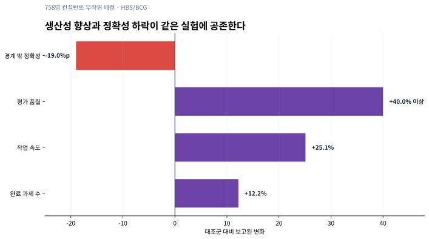
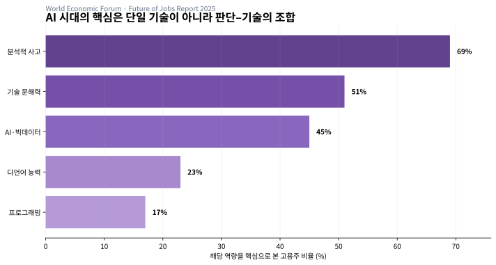

{.hero width=100% fig-alt="코드·언어·도메인 지식이 AI 프리즘으로 합쳐지는 모습"}

```{=html}
<style>
figure.figure{margin:28px 0 34px;padding:18px;border:1px solid rgba(148,163,184,.36);border-radius:22px;background:linear-gradient(180deg,rgba(255,255,255,.98),rgba(248,250,252,.98));box-shadow:0 18px 48px rgba(15,23,42,.10)}
figure.figure img{border-radius:14px}
figure.figure figcaption{margin-top:10px;padding:10px 12px 0;border-top:1px solid rgba(226,232,240,.85);color:#475569;font-size:13px;line-height:1.55}
.eq{margin:20px 0;padding:18px 20px;border-left:5px solid #6d42a6;border-radius:12px;background:rgba(109,66,166,.09);font-size:1.04rem}
.evidence-ledger{display:grid;grid-template-columns:repeat(auto-fit,minmax(210px,1fr));gap:13px;margin:20px 0}.evidence-ledger>div{padding:17px;border:1px solid #ddd3ef;border-radius:14px;background:#faf8ff}.evidence-ledger b{display:block;color:#62418f;font-size:1.2rem}.evidence-ledger small{display:block;margin-top:8px;color:#5f6c80;line-height:1.5}
.boundary-grid{display:grid;grid-template-columns:repeat(auto-fit,minmax(230px,1fr));gap:14px;margin:20px 0}.boundary-grid>div{padding:18px;border-top:4px solid #7650a8;border-radius:14px;background:rgba(118,80,168,.08)}.boundary-grid h3{margin-top:0}
</style>
```

::: {.callout-note}
## 한 줄 결론
AI 사용능력은 답을 빨리 얻는 기술이 아니다. **기계의 유창함을 이용하면서도 무엇을 물을지, 무엇을 믿을지, 언제 의심할지, 누가 책임질지를 인간이 계속 결정하는 인식론적 자율성**이다.
:::

# 더 빨라졌는데, 더 유능해진 것인가

생성형 AI는 실제로 일을 빠르게 한다. Noy와 Zhang의 사전등록 무작위 실험에서 대학 교육을 받은 전문직 종사자 453명은 직무 관련 글쓰기 과제를 수행했다. ChatGPT를 사용할 수 있었던 집단은 평균 작업시간이 **40% 감소**했고, 독립 평가자가 매긴 품질은 **18% 상승**했다. 이 결과만 보면 AI 사용능력은 도구를 켜고 결과를 얻는 능력처럼 보인다. 그러나 이 결론은 다음 실험에서 곧 흔들린다. [Science 논문](https://doi.org/10.1126/science.adh2586)

Harvard Business School과 Boston Consulting Group이 컨설턴트 758명을 대상으로 수행한 사전등록 실험에서는 AI 능력 경계 안쪽의 18개 과제에서 GPT-4 사용자가 평균 **12.2% 더 많은 과제**를 끝냈고, **25.1% 더 빨랐으며**, 품질은 대조군보다 **40% 이상 높았다**. 하지만 AI 경계 바깥에 배치된 과제에서는 AI 사용자가 정답을 낼 확률이 대조군보다 **19%포인트 낮았다**. 같은 사람이 같은 도구를 사용해도 과제가 경계의 어느 쪽에 있느냐에 따라 증강이 손상으로 뒤집힌 것이다. 연구진은 이를 **들쭉날쭉한 기술 경계(jagged technological frontier)**라고 불렀다. [HBS 연구 소개](https://aiinstitute.hbs.edu/navigating-the-jagged-technological-frontier/), [연구 원문](https://www.hbs.edu/ris/download.aspx?name=24-013.pdf)

{#fig-jagged-frontier fig-alt="AI 경계 안에서는 완료 과제, 속도, 품질이 개선되지만 경계 밖 과제에서는 정확성이 19퍼센트포인트 하락한 막대그래프"}

이 모순이 이 글의 출발점이다. **AI를 잘 쓴다는 것은 AI가 잘하는 과제에서 속도를 얻는 능력이면서, AI가 못하는 과제에서 그 속도를 거부하는 능력**이어야 한다. 프롬프트 기법만으로는 두 영역을 구분할 수 없다. 경계를 찾으려면 도메인 지식, 근거 평가, 자기 확신의 교정, 결과에 대한 책임이 필요하다.

# 과학의 관점: 핵심은 지능보다 교정이다

## 인지적 외주화는 손실이 아니라 재배치다

사람은 오래전부터 기억을 노트에, 계산을 계산기에, 길 찾기를 지도에 맡겼다. AI도 인지적 외주화(cognitive offloading)의 연장선에 있다. 외주화 자체는 퇴화와 동의어가 아니다. 계산기를 사용해 산술 부담을 줄이면 더 높은 수준의 모델링에 집중할 수 있다. 문제는 **무엇을 외주화했고 무엇을 인간이 계속 감시하는지 모를 때** 생긴다.

Microsoft Research와 Carnegie Mellon 연구진은 주 1회 이상 생성형 AI를 업무에 쓰는 지식노동자 319명에게 실제 사용 사례 936건을 수집했다. 높은 AI 신뢰는 비판적 사고를 덜 수행하는 경향과, 높은 과제별 자기확신은 비판적 사고를 더 수행하는 경향과 연관됐다. 비판적 사고의 위치도 바뀌었다. 직접 생산에서 **정보 검증, 답변 통합, 작업 감독**으로 이동했다. 이는 자기보고식 횡단면 조사이므로 “AI가 사고력을 인과적으로 저하시켰다”고 단정할 수 없다. 그러나 무엇을 교육해야 하는지는 보여준다. 더 많은 프롬프트가 아니라 **신뢰를 교정하는 방법**이다. [CHI 2025 논문 및 초록](https://www.microsoft.com/en-us/research/publication/the-impact-of-generative-ai-on-critical-thinking-self-reported-reductions-in-cognitive-effort-and-confidence-effects-from-a-survey-of-knowledge-workers/)

<div class="evidence-ledger">
<div><b>453명</b>Noy–Zhang 무작위 실험<small>전문 글쓰기에서 시간 −40%, 품질 +18%. 특정 과제군의 단기 생산성 근거.</small></div>
<div><b>758명</b>HBS–BCG 무작위 실험<small>경계 안 성능 향상과 경계 밖 정확성 −19%p가 동시에 관측됨.</small></div>
<div><b>319명·936건</b>Microsoft–CMU 조사<small>AI 신뢰·자기확신과 비판적 사고의 연관. 자기보고 자료이며 인과효과가 아님.</small></div>
</div>

## 유창성은 정확도의 센서가 아니다

언어모델의 답변은 문법적 매끄러움과 사실적 타당성을 같은 신호로 표현한다. 사람은 유창한 설명을 더 쉽게 처리하고 더 참이라고 느끼는 처리 유창성 편향에 노출된다. 따라서 결과가 잘 읽힌다는 감각은 정확성의 측정기가 될 수 없다. 필요한 것은 **확신(confidence)과 실제 정답률(correctness)의 간격**을 줄이는 교정(calibration)이다.

개념적으로 사람의 확신을 (c), 비슷한 과제에서 실제로 맞힌 비율을 (p)라고 두면 교정오차는 다음처럼 생각할 수 있다.

<div class="eq">
\[
E_{cal}=|c-p|
\]
</div>

이 식은 이 글이 제안하는 교육용 진단모형이지 앞선 연구가 검증한 단일 지표가 아니다. 중요한 것은 “AI를 믿습니까?”라고 묻는 대신, **80% 확신한 답이 장기적으로 실제 80% 맞는가**를 기록하는 것이다. AI 리터러시는 자신감의 크기가 아니라 자신감이 근거와 맞물리는 정도다.

# 인문학의 관점: 답이 아니라 판단의 주권

## 칸트 — 대신 생각해 주는 존재와 미성숙

칸트의 계몽 개념은 단순히 많은 정보를 아는 상태가 아니다. 타인의 지도 없이 자신의 이해력을 사용할 용기, 즉 판단의 자율성을 문제 삼는다. AI는 역사상 가장 편리한 ‘대신 생각해 주는 존재’가 될 수 있다. 그렇다고 모든 도움을 거부하는 것이 자율성은 아니다. 지도·사전·교사의 도움을 받아도 최종 판단의 근거를 자신이 검토할 수 있다면 자율성은 유지된다.

AI 시대의 미성숙은 도구 사용 그 자체가 아니라 다음 문장에 나타난다.

> “모델이 그렇게 말했기 때문에 결정했다.”

이 문장은 인과 설명일 수는 있어도 정당화는 아니다. 정당화에는 왜 그 자료를 선택했는지, 어떤 반례를 확인했는지, 피해가 생기면 누가 수정할지가 포함돼야 한다. 칸트의 자율성 개념을 AI에 적용하면 리터러시는 **답변 생산능력**이 아니라 **판단을 위임하고도 책임을 회수할 수 있는 능력**이 된다. [Stanford Encyclopedia of Philosophy: Kant](https://plato.stanford.edu/archives/spr2020/entries/kant/)

## 증언의 인식론 — 우리는 원래 남의 말을 믿고 산다

“직접 확인하지 않은 것은 믿지 말라”는 구호는 현실적으로 불가능하다. 과학 논문, 동료의 측정값, 기술문서, 역사 기록처럼 인간 지식의 대부분은 타인의 증언을 통해 전달된다. 증언의 인식론이 묻는 것은 믿음 자체를 없앨 수 있는지가 아니라, **어떤 조건에서 타인의 말이 지식이 되는가**다. AI 답변도 새로운 종류의 증언처럼 작동하지만 중요한 차이가 있다. 모델은 출처의 저자가 아니며, 문장을 생성한 과정에서 어떤 자료가 결정적이었는지 안정적으로 설명하지 못할 수 있다. [Stanford Encyclopedia of Philosophy: Epistemological Problems of Testimony](https://plato.stanford.edu/archives/spr2013/entries/testimony-episprob/)

따라서 AI의 답은 곧바로 지식이 아니라 **검증 대기 중인 주장**으로 다루는 편이 정확하다. 출처를 요구하는 것만으로 충분하지 않다. 링크가 실제 주장과 일치하는지, 인용한 연구의 모집단이 현재 문제와 같은지, 상관관계를 인과관계로 바꾸지 않았는지 확인해야 한다.

## 해석학과 권력 — 프롬프트 이전에 세계를 잘라내는 방식

프롬프트는 중립적 질문이 아니다. 무엇을 성공으로 정의하고 어떤 변수를 제외할지 이미 결정한다. “불량률을 낮춰라”는 요청은 비용, 작업자 부담, 검사 누락, 고객 체감품질 가운데 무엇을 우선할지 말하지 않는다. AI가 최적화한 답은 질문에 들어 있던 가치판단을 확대한다.

여기서 인문학은 장식이 아니라 누락 탐지기다.

- **해석학:** 데이터가 만들어진 역사와 맥락은 무엇인가?
- **윤리학:** 오류 비용을 누가 부담하는가?
- **정치철학:** 누가 목표를 정하고 누가 이의를 제기할 수 있는가?
- **언어학:** 번역 과정에서 어떤 현장 개념이 사라졌는가?

UNESCO의 AI 역량 프레임워크가 기술 사용법만 다루지 않고 인간중심 관점, AI 윤리, 기술·응용, 시스템 설계의 네 차원을 함께 둔 이유도 여기에 있다. 12개 역량은 이해–적용–창조의 세 수준으로 전개되며, 비판적 판단과 시민적 책임을 포함한다. [UNESCO AI Competency Framework](https://www.unesco.org/en/articles/ai-competency-framework-students?hub=195885)

# 노동 데이터가 말하는 것: 기술 하나로는 부족하다

세계경제포럼의 *Future of Jobs Report 2025*는 1,000개가 넘는 기업의 응답을 바탕으로 현재 핵심 역량을 조사했다. 분석적 사고를 핵심으로 본 고용주는 69%, 기술 문해력 51%, AI·빅데이터 45%였다. 다언어 능력은 23%, 프로그래밍은 17%였다. 낮은 비율을 중요하지 않다는 뜻으로 읽으면 안 된다. 이 값은 임금수익률이나 미래 성장률이 아니라 **해당 역량을 현재 핵심으로 꼽은 고용주의 비율**이다. [WEF 보고서 PDF](https://www3.weforum.org/docs/WEF_Future_of_Jobs_Report_2025.pdf)

{#fig-wef-skills fig-alt="분석적 사고 69퍼센트, 기술 문해력 51퍼센트, AI 빅데이터 45퍼센트, 다언어 23퍼센트, 프로그래밍 17퍼센트 막대그래프"}

보고서는 2030년까지 77%의 고용주가 기존 인력이 AI와 더 효과적으로 일하도록 재교육할 계획이며, 69%는 AI 도구 설계·개선 인재, 62%는 AI 협업 숙련자를 채용할 계획이라고 답했다고 전한다. 동시에 인간중심 기술과 분석적 사고를 계속 강조한다. 노동시장이 요구하는 것은 ‘코딩 또는 인문학’의 선택이 아니라, **기술을 실행하면서 문제의 의미와 결과의 책임을 읽는 결합능력**이다. [WEF Workforce Strategies](https://www.weforum.org/publications/the-future-of-jobs-report-2025/in-full/4-workforce-strategies/)

# 경계에서 얻은 새로운 모형: 인식론적 레버리지

앞선 연구와 인문학을 병렬로 놓는 것만으로는 Insight Lab의 분석이 되지 않는다. 둘을 교차하면 AI 사용능력을 다음 네 요소의 곱으로 볼 수 있다.

<div class="eq">
\[
L_{AI}=A\times D\times V\times R
\]

- \(A\): **Agency** — 문제와 성공조건을 사람이 정의하는 능력
- \(D\): **Domain model** — 이상징후와 경계 밖 과제를 알아보는 도메인 지식
- \(V\): **Verification** — 출처·테스트·반례로 확신을 교정하는 능력
- \(R\): **Responsibility** — 권한·피해·승인·롤백의 주체를 명시하는 능력
</div>

이 곱셈식은 검증된 심리측정 척도가 아니라 이 글의 **규범적·운영적 합성모형**이다. 곱셈으로 쓴 이유는 한 요소의 결핍을 다른 요소의 과잉이 완전히 보상하지 못하기 때문이다. 프롬프트가 뛰어나도 도메인 지식이 0이면 경계 밖 오류를 감지하기 어렵다. 검증을 잘해도 책임 주체가 없으면 오류를 발견한 뒤 조치할 수 없다. 윤리의식이 있어도 도구를 실행하지 못하면 실제 변화가 일어나지 않는다.

<div class="boundary-grid">
<div><h3>생산성 ≠ 역량</h3><p>시간 단축은 도구 효과다. 경계 밖 과제를 식별하고 사용을 중단할 수 있을 때 비로소 사용자 역량이 된다.</p></div>
<div><h3>검증 = 학습</h3><p>검증은 마지막 승인 단계가 아니다. 모델이 실패한 조건을 축적해 다음 위임 범위를 바꾸는 피드백 과정이다.</p></div>
<div><h3>도메인 지식 = 센서</h3><p>AI가 초안을 만들수록 전문가의 가치는 타이핑량보다 이상징후·누락·불가능한 인과를 감지하는 데 이동한다.</p></div>
<div><h3>리터러시 = 조직 속성</h3><p>개인이 영리해도 접근권한, 로그, 이중승인, 롤백이 없으면 조직은 안전하게 AI를 사용할 수 없다.</p></div>
</div>

이 네 결론은 어느 한 분야만으로 나오지 않는다. 생산성 실험은 AI의 이득과 경계를 보여주지만 왜 판단을 양도하면 안 되는지는 말하지 않는다. 철학은 자율성과 책임을 설명하지만 어느 과제에서 오류가 늘어나는지는 측정하지 않는다. **과학은 경계의 위치를 측정하고, 인문학은 그 경계를 넘을 권한과 책임을 묻는다.** 이것이 두 관점이 실제로 만나는 지점이다.

# AI 리터러시를 어떻게 측정할 것인가

자격시험처럼 프롬프트 문법을 묻는 평가는 부족하다. 같은 사람이 AI 없이, AI와 함께, 그리고 의도적으로 AI 경계 밖에 놓인 과제를 수행하게 해야 한다. 최소 평가 설계는 다음과 같다.

| 단계 | 측정 | 질문 |
|---|---|---|
| 기준선 | 시간·정확도·근거 품질 | AI 없이 문제를 어디까지 이해하는가? |
| 증강 과제 | 시간·품질·재작업률 | AI가 실제 생산성을 높였는가? |
| 경계 밖 과제 | 오류 탐지율·중단률 | 그럴듯하지만 틀린 답을 거부하는가? |
| 출처 교란 | 인용 정확도·원문 일치율 | 링크 존재가 아니라 주장 지지를 확인하는가? |
| 책임 시나리오 | 승인·에스컬레이션 적합성 | 개인정보·안전·재무 위험에서 멈추는가? |
| 사후 회고 | 교정오차·규칙 개선 | 실패를 다음 작업의 위임정책에 반영하는가? |

개인 평가만으로 끝내지 말아야 한다. 조직 수준에서는 AI 사용 전후의 처리시간과 함께 다음을 기록한다.

- 독립 검증 없이 통과한 주장 비율
- 허위·무관 인용률과 재작업률
- 사람의 수정으로 뒤집힌 중요 결정 수
- 경계 밖 과제에서 적절히 중단·에스컬레이션한 비율
- 사고 발생 시 원본·프롬프트·도구·승인자를 복원하는 시간
- 다른 구성원이 같은 입력으로 결과를 재현한 비율

이렇게 측정하면 ‘AI를 많이 쓰는 사람’과 ‘AI를 책임 있게 잘 쓰는 사람’을 구분할 수 있다. 전자는 호출량이 많고, 후자는 **적절한 위임 범위를 넓히면서도 치명적 오류와 복구시간을 줄인다.**

# FDE와 현장 엔지니어에게 적용하면

Forward Deployed Engineer가 고객의 요구를 받아 프로토타입을 만드는 일은 번역 작업처럼 보인다. 그러나 실제로는 네 종류의 번역이 동시에 일어난다.

1. 고객의 모호한 언어를 측정 가능한 성공조건으로 번역한다.
2. 현장 데이터를 모델이 처리할 수 있는 구조로 번역한다.
3. 모델 출력을 업무시스템과 승인 흐름으로 번역한다.
4. 오류·비용·보안 위험을 경영 판단의 언어로 번역한다.

여기서 외국어, 코딩, 도메인 지식은 더 이상 독립 자격이 아니다. 외국어는 원문·논문·고객 맥락 사이의 **인식론적 라우팅**, 코딩은 주장과 절차를 실행 가능한 테스트로 바꾸는 **재현 장치**, 도메인 지식은 모델이 경계를 넘는 순간을 감지하는 **오류 센서**가 된다. 인문학은 목표와 책임을 묻고, 과학은 효과와 실패를 측정한다.

따라서 좋은 포트폴리오는 “어떤 모델을 사용했다”보다 다음을 증명해야 한다.

- AI 이전과 이후의 시간·품질·오류율
- 실제 데이터와 합성 데이터의 경계
- 사람이 승인해야 하는 결정과 자동화 가능한 결정
- 실패 사례, 반례, 롤백 절차
- 다른 팀이 재현할 수 있는 코드·출처·결정 로그

# 반론과 한계

첫째, 이 글이 인용한 세 연구는 서로 다른 과제와 방법을 사용했다. Noy–Zhang과 HBS–BCG는 통제된 단기 과제이며 장기 학습효과를 직접 측정하지 않는다. Microsoft–CMU 연구는 실제 업무 사례를 폭넓게 모았지만 자기보고 자료이므로 인과 추론에 한계가 있다. 수치를 하나의 종합효과로 합치지 않은 이유다.

둘째, WEF 조사는 고용주의 기대를 측정한다. 실제 개인의 생산성, 임금, 채용확률을 직접 뜻하지 않는다. ‘핵심 역량 응답률’과 ‘미래 성장속도’도 다른 개념이다.

셋째, 칸트의 자율성과 증언의 인식론을 AI에 적용한 부분은 철학적 해석이다. 언어모델이 인간 증언자와 동일하다는 주장이 아니다. 오히려 저자성·의도·책임이 불분명하기 때문에 더 강한 검증이 필요하다는 제한된 비교다.

넷째, (L_{AI}=A\times D\times V\times R)은 교육과 운영을 설계하기 위한 개념모형이다. 실제 평가도구로 사용하려면 각 요소의 문항, 신뢰도, 예측타당도를 별도로 검증해야 한다.

::: {.callout-important}
## 결론 — AI 시대의 문해력은 ‘판단을 되찾는 기술’이다
읽고 쓰는 능력이 문자에 접근하게 했고, 코딩이 계산 가능한 세계에 접근하게 했다면, AI 리터러시는 **기계가 만든 가능성 가운데 무엇을 현실로 승인할지 결정하는 능력**이다.

AI는 생산비용을 낮춘다. 그러나 경계 밖에서는 틀린 답의 생산비용도 낮춘다. 그래서 가장 중요한 사용능력은 더 정교한 명령문이 아니라, 문제의 의미를 정의하고, 확신을 근거에 맞게 교정하며, 실패할 때 멈추고, 결정의 책임을 인간과 조직 안에 남기는 능력이다.

**AI가 대신 만들어 줄 수 있는 것이 많아질수록, 무엇을 만들 가치가 있는지 판단하는 인간의 책임은 줄어들지 않고 커진다.**
:::

# 자료와 재현 범위

- Shakked Noy & Whitney Zhang, [Experimental evidence on the productivity effects of generative artificial intelligence](https://doi.org/10.1126/science.adh2586), *Science* (2023).
- Fabrizio Dell’Acqua et al., [Navigating the Jagged Technological Frontier](https://www.hbs.edu/ris/download.aspx?name=24-013.pdf), HBS Working Paper 24-013.
- Hao-Ping Lee et al., [The Impact of Generative AI on Critical Thinking](https://doi.org/10.1145/3706598.3713778), CHI 2025.
- UNESCO, [AI competency framework for students](https://www.unesco.org/en/articles/ai-competency-framework-students?hub=195885), 2024.
- World Economic Forum, [Future of Jobs Report 2025](https://www3.weforum.org/docs/WEF_Future_of_Jobs_Report_2025.pdf).
- Stanford Encyclopedia of Philosophy, [Kant](https://plato.stanford.edu/archives/spr2020/entries/kant/) 및 [Epistemological Problems of Testimony](https://plato.stanford.edu/archives/spr2013/entries/testimony-episprob/).

두 그래프의 데이터는 위 연구·보고서에 공개된 집계값을 [`generate_ai_literacy_charts.py`](generate_ai_literacy_charts.py)에 직접 입력해 재구성했다. 원자료 수준의 재분석은 아니며, HBS 그래프의 네 막대는 결과변수와 단위가 다르므로 동일 효과크기로 비교하거나 합산해서는 안 된다.
