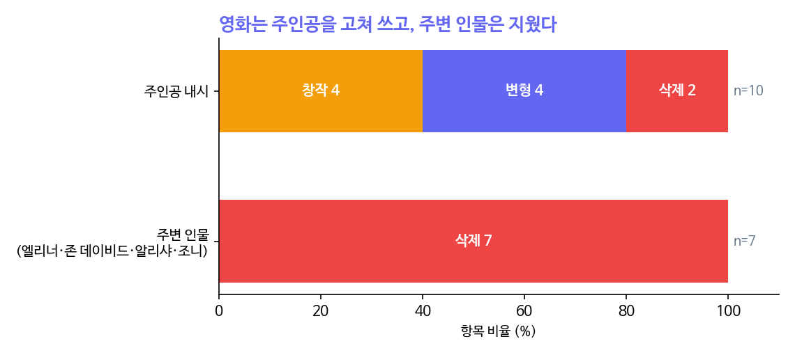
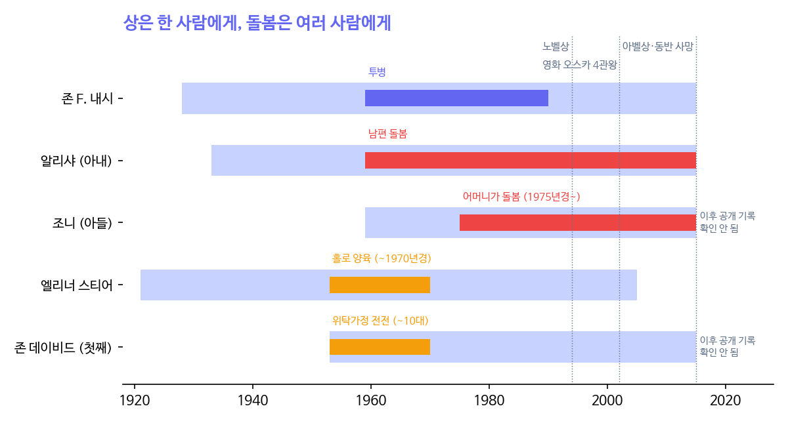

```{=html}
<style>
.cell-output-display img, figure img, .quarto-figure img { max-width:100% !important; height:auto !important; }
@media (max-width:640px){ .cell-output-display img, figure img { width:100%; } .figure-caption, figcaption { font-size:.82rem; } }
</style>
```

::: {.callout-note}
## 핵심 문장

영화 《뷰티풀 마인드》가 실제와 다르게 그린 17개 항목을 세어 보니, 주인공 내시에 관한 10개는 8개가 **고쳐 쓰기**(창작 4·변형 4)였고, 주변 인물에 관한 7개는 7개 모두 **삭제**였다. 지워진 사람들 — 버려진 첫아들과 그 어머니, 이혼하고도 남편을 다시 들인 아내, 같은 병을 물려받은 둘째 아들 — 에게는 공통점이 있다. 그들이 화면에 남았다면 영화의 결말은 '균형'이 아니었을 것이다. 이야기는 두 사람짜리 게임으로 닫혀야 아름다웠고, 그 게임의 비용을 낸 사람들은 판 밖에 있었다.
:::

# 영화를 보고 운 날

2026년 10월 5일, 한 사람이 《뷰티풀 마인드》를 보고 "감동"이라고 적었다. 그리고 그는 질문을 이어 갔다. 내시의 연구는 무엇이었나, 그는 어떻게 죽었나, 무엇이 그를 미치게 했나, 그가 버린 첫아들은 어떻게 살았나, 같은 병을 앓은 둘째는 무엇을 연구했나, 아내는 어떻게 버텼나.

질문을 따라갈수록 영화 속 이야기와 기록 속 이야기가 갈라졌다. 영화는 한 천재가 병을 이기고 사랑으로 구원받는 이야기다. 기록은 한 집에 조현병 진단을 받은 사람이 둘이었고, 그 집 밖에 아버지 없이 자란 아이가 하나 있었으며, 그 모두를 떠받친 사람이 둘이었다는 이야기다.

이 글은 그 차이를 센다. 숫자로 셀 수 있는 것만 센다. 학술 기록 쪽은 자매지 헤아림에 따로 실었다 — [HEARIM 특별편 제1호](https://waterfirst.pro/hearim/sp1/nash-family/ko/).

# 영화가 바꾼 17가지

영어 위키백과의 영화 문서는 '사실과 다른 점'을 15개 항목으로 정리해 두었다. 여기에 출처가 분명한 2개(아들 조니의 조현병, 알리샤의 생계 노동)를 더해 17개를 만들고, 각 항목을 **누구에 관한 것인지**(주인공 내시 / 주변 인물)와 **어떻게 바꿨는지**(창작 / 변형 / 삭제)로 나눴다.

| 구분 | 창작 | 변형 | 삭제 |
|---|---|---|---|
| **주인공 내시** (10) | 시각 환각(찰스·파처·마시), 휠러 연구소, 펜 의식, 노벨상 수락 연설 | RAND→펜타곤, 술집 장면의 균형 설명, 발병 시기, "새 약을 먹는다" | 1954년 체포·보안허가 상실, 기하·편미분방정식 업적 |
| **주변 인물** (7) | — | — | 첫아들 존 데이비드, 그 어머니 엘리너, 1963년 이혼, 1970년 하숙인 수용, 2001년 재혼, 조니의 조현병, 알리샤의 생계 노동 |

: **표 1.** 영화와 실제의 차이 17개 항목의 분류. 15개는 위키백과 영화 문서 'Historical accuracy' 절, 2개는 편집부 추가(출처: 위키백과 "Alicia Nash", Nasar 1998, Town Topics 2015). 분류는 편집부 판단이며 원자료는 `output/data/sp33/coding.json`.

{fig-alt="주인공 내시 10개 항목 중 창작 4, 변형 4, 삭제 2. 주변 인물 7개 항목은 모두 삭제."}

주인공에게 한 일은 대부분 **덧붙이고 비트는 것**이었다. 목소리로 들리던 환청을 눈에 보이는 룸메이트로 만들었고, 없던 의식을 만들어 교수들이 펜을 내려놓게 했고, 하지 않은 노벨상 연설을 시켰다. 그는 더 극적으로 아팠고 더 극적으로 인정받았다.

주변 인물에게 한 일은 하나뿐이었다. **지우기.**

# 지워진 사람들

## 엘리너와 존 데이비드

1952년 보스턴에서 내시는 일곱 살 연상인 간호사(1921년생) 엘리너 스티어를 만났다. 1953년 6월 19일 아들 존 데이비드가 태어났다. 위키백과의 표현으로, 내시는 엘리너가 임신 사실을 알리자 그녀를 버렸다. 출생증명서의 아버지 칸은 비어 있다. 나사르의 전기에 따르면 내시는 엘리너를 자기보다 학력과 계층이 낮다고 여겼고 양육비도 제대로 대지 않았다.

존 데이비드는 위탁가정을 전전했고, 그중에는 학대하는 집도 있었다. 10대가 되어서야 어머니에게 돌아왔다. 그는 어머니처럼 간호사가 되었다. 내시는 병에서 회복되던 1980~90년대에 보스턴의 두 사람을 몇 번 찾아갔다. 엘리너는 2005년에 세상을 떠났다.

## 알리샤

영화는 알리샤를 '끝까지 곁에 남은 아내'로 그린다. 기록 속 알리샤는 **떠났다가 돌아온** 사람이다. 1959년 출산을 앞두고 남편을 직접 입원시켰고, 1963년 이혼했고, 1970년 갈 곳 없는 전남편을 하숙인으로 들였고, 2001년 다시 결혼했다. 그 사이 MIT 물리학 학위를 접고 RCA·콘에디슨·뉴저지 트랜짓에서 프로그래머와 데이터 분석가로 일하며 조현병 진단을 받은 가족 둘을 먹여 살렸다.

영화가 지운 세 사건(이혼·하숙·재혼)은 그녀의 사랑을 깎아내리지 않는다. 오히려 그 사랑이 **선택의 연속**이었다는 증거다. 떠날 수 있었고 실제로 떠났지만, 다시 들였다.

## 조니

1959년 5월, 아버지가 매클린 병원에 있을 때 태어난 존 찰스 마틴 내시는 고등학교 때 목소리를 듣기 시작했고, 아버지와 같은 진단을 받았다. 고등학교도 대학도 마치지 못했지만 1985년 럿거스대에서 수학 박사학위를 받았고, 덧셈 정수론 논문 다섯 편을 냈다(헤아림 특별편 참조). 그는 끝내 혼자 살 만큼 회복되지 못했고 평생 부모와 함께 살았다.

영화에서 아들은 품에 안긴 아기로만 나온다.

{fig-alt="존 내시 1928~2015 생애와 1959~1990 투병, 알리샤 1959~2015 돌봄, 조니 1975년경~2015 어머니 돌봄, 엘리너 1953~1970년경 홀로 양육, 존 데이비드 위탁가정 기간"}

상은 한 사람이 받았다. 1994년 노벨상, 2015년 아벨상. 영화는 2002년 아카데미 4개 부문을 받았고, 알리샤를 연기한 배우가 그중 하나를 받았다. 돌봄은 여러 사람이 했고, 그 돌봄은 상을 받지 않았다. 알리샤는 2005년 정신질환 연구재단의 상을 받았다 — 영화가 나온 뒤였다.

# 세 분야가 각각 말하는 것

**영화서사학.** 각색은 압축이다. 50년을 135분에 넣으려면 무언가를 빼야 한다. 서사학의 '초점화' 개념으로 보면, 영화는 내시의 지각(환각 포함)을 카메라의 눈으로 삼았다. 그의 눈에 보이지 않던 사람들 — 그가 외면한 엘리너와 존 데이비드, 그가 아팠던 동안 일하러 나간 알리샤 — 은 카메라에도 보이지 않는다. 지운 것은 각본가만이 아니라 시점 자체다.

**게임이론.** 내시 균형은 각 참가자의 보상표에 적힌 것만 계산한다. 보상표에 없는 사람의 손익은 균형에 들어가지 않는다. 영화는 이야기를 '내시 대 병', '내시와 알리샤'라는 두 사람짜리 게임으로 짰고, 그 균형은 아름답게 닫힌다. 엘리너의 보상(버려짐)이나 조니의 보상(물려받은 병, 오지 않은 회복)을 보상표에 넣으면 그 균형은 깨진다. 주인공은 변명이 필요한 남자가 되고, 결말의 '회복'은 다음 세대에서 되풀이되는 병이 된다.

**돌봄사회학.** 돌봄 노동은 측정되지 않는 노동이다. 임금 통계에도, 논문 색인에도, 영화 크레디트에도 잘 잡히지 않는다. 정신의학 연구는 가족이 비판적이거나 간섭이 심할 때보다 차분하고 관대할 때 재발이 적다는 것을 반복해서 보여 왔다('표현된 감정' 연구). 내시가 약 없이 회복했다고 말한 그 환경을 만든 것은 알리샤였다. 회복의 영수증은 남편 이름으로 발행됐다.

# 경계에서만 나오는 명제

세 분야를 겹치면 하나의 명제가 나온다.

> **이야기의 균형은 보상표 밖에 있는 사람의 비용으로 유지된다. 그리고 그 사람은 대개 돌봄을 한 사람이거나, 돌봄을 받지 못한 사람이다.**

표 1이 이것을 데이터로 보여 준다. 지워진 7개 항목은 둘로 나뉜다. 돌봄을 한 사람(알리샤의 이혼·하숙·재혼·생계 노동, 엘리너의 홀로 양육)과 돌봄을 받지 못한 사람(존 데이비드, 조니의 병). 영화가 지우지 않은 주변 인물 사건 — 알리샤가 남편을 입원시키는 장면, 아기의 탄생 — 은 주인공의 이야기를 앞으로 미는 장면들뿐이다.

서사학만으로는 "압축이 필요했다"에서 멈추고, 게임이론만으로는 "보상표가 작았다"에서 멈추고, 돌봄사회학만으로는 "돌봄은 보이지 않는다"에서 멈춘다. 셋을 겹쳐야 **누가** 지워지는지가 예측된다. 결말을 흔들 보상을 가진 사람, 그리고 그 보상이 돌봄의 장부에 적혀 있는 사람이다.

# 이 글을 쓰는 동안

이 글은 한 사람의 질문과 Claude(Anthropic)의 조사가 오간 대화에서 나왔다. 과정에서 고친 것들을 남긴다.

- 연표(그림 2)의 첫 초안은 두 아들의 생애 막대를 2026년까지 그렸다. 두 사람이 지금 살아 있다는 공개 기록을 확인하지 못했으므로 2015년에서 끊고 "이후 확인 안 됨"이라고 적었다.
- 엘리너의 홀로 양육 기간과 조니의 발병 시점은 정확한 연도가 기록되지 않아 '~경'으로 표시했다.
- 2015년 사고 당시 안전벨트 착용 여부는 경찰 발표("불확실")와 위키백과("매지 않음")가 다르다. 이 글은 어느 쪽도 주장하지 않는다.
- 위키백과 목록은 '영화가 틀린 점'에 관심 있는 편집자들이 모은 것이다. 처음부터 삭제·왜곡 쪽으로 기울어 있을 수 있다(아래 반대해석).

::: {.callout-warning}
## 반대 해석 — 이 명제가 성립하지 않는 곳

1. **지운 것은 보호일 수 있다.** 엘리너와 존 데이비드, 조니는 영화 제작 당시 살아 있던 사인(私人)이다. 동의 없이 그들의 삶을 화면에 올리는 것이 더 큰 폭력일 수 있다. 실존 인물을 함부로 재현하지 않는 것은 윤리적 선택이고, '지우기'는 '지켜 주기'와 겉모습이 같다. 이 해석이 맞다면 표 1의 삭제 7개는 서사의 균형이 아니라 사생활 보호로 설명된다.
2. **매체의 문제다.** 나사르의 전기는 이 사람들을 모두 다룬다. 같은 이야기가 책에서는 지워지지 않았다. 지운 것은 '이야기'가 아니라 '두 시간짜리 영화'라는 형식일 수 있다.
3. **고쳐 쓰기도 선의일 수 있다.** "새 약을 먹는다"는 대사는 조현병 환자에게 약을 끊으라는 신호로 읽힐까 봐 감독이 일부러 넣었다(론 하워드). 사실 왜곡이 공중보건의 판단일 수 있다.
4. **표본이 작고 분류가 주관적이다.** n = 17이고, 창작·변형·삭제의 경계는 편집부의 판단이다. 다른 사람이 분류하면 숫자가 달라질 수 있다. "주인공은 80%, 주변 인물은 100%"는 경향이지 법칙이 아니다.
5. **보상표 비유의 한계.** 내시 균형은 참가자가 합리적으로 최선을 고른다는 모형이다. 각본가는 게임의 참가자가 아니라 게임을 설계하는 사람이다. 이 글의 게임이론은 엄밀한 모형이 아니라 구조를 보는 렌즈로 썼다.
:::

# 남는 질문

알리샤와 존 내시는 2015년 5월 23일 같은 택시 안에서 함께 세상을 떠났다. 평생 돌봄을 받던 조니는 돌봐 줄 두 사람을 한꺼번에 잃었다. 그해 가을 프린스턴의 추모 기사에 조니의 이름이 없자, 한 주민이 지역 신문에 편지를 보냈다. "그들의 아들도 수학 박사를 받았다. 그 역시 아버지와 같은 병을 앓았다."

이야기가 끝난 뒤에도 보상표 밖의 사람들은 계속 산다. 그들이 어떻게 사는지는, 이번에도 기록되지 않았다.

# 참고 문헌

- Wikipedia, "A Beautiful Mind" — Historical accuracy 절 (2026-10-05 접속). 원자료 분류 15개 항목의 출처.
- Wikipedia, "Alicia Nash" (2026-10-05 접속).
- Nasar, S. (1998). *A Beautiful Mind*. Simon & Schuster.
- Town Topics (2015-11-04). "No Mention of John Charles Martin Nash In Article on John and Alicia Nash Memorial." 독자 편지.
- LitCharts, *A Beautiful Mind* 인물 해설: John David Stier, Eleanor Stier, John Charles Martin Nash.
- PBS American Experience, *A Brilliant Madness* (2002).
- Live Science (2015). "How 'Beautiful Mind' Mathematician John Nash's Schizophrenia 'Disappeared'."
- Rutgers Experimental Mathematics Seminar, 2005-04-21 (Zeilberger) — 조니의 학위 기록.
- HEARIM 편집실 (2026). 세 개의 기록, 한 가정. *HEARIM* 특별편 제1호. https://waterfirst.pro/hearim/sp1/nash-family/ko/
