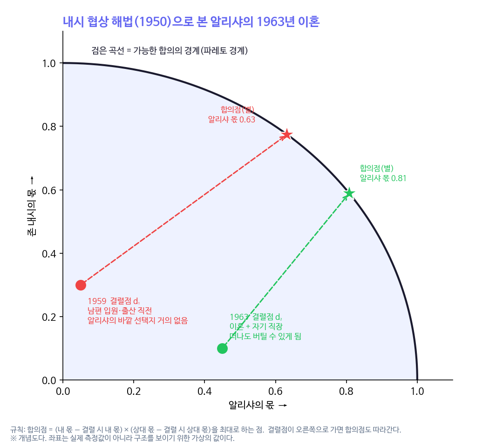
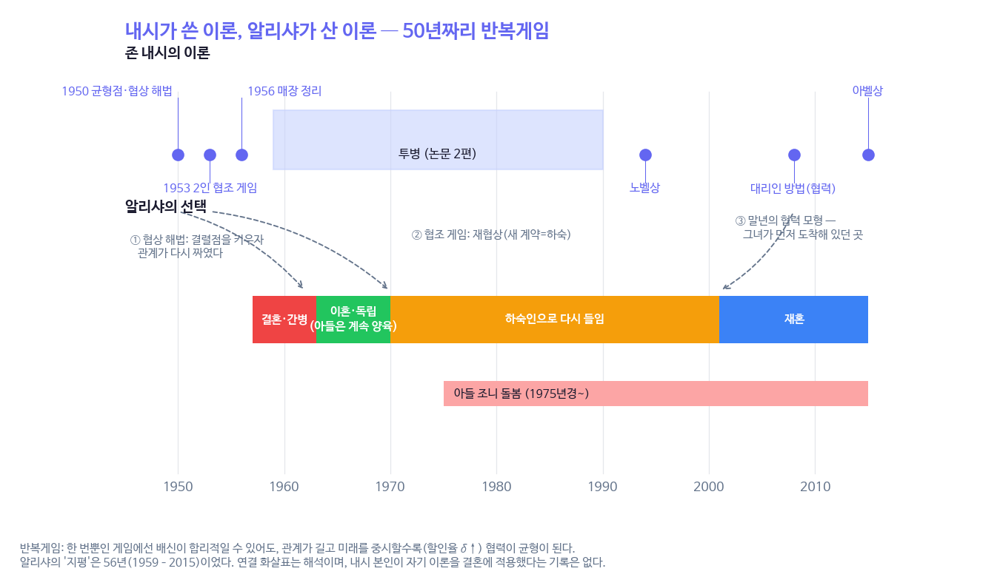
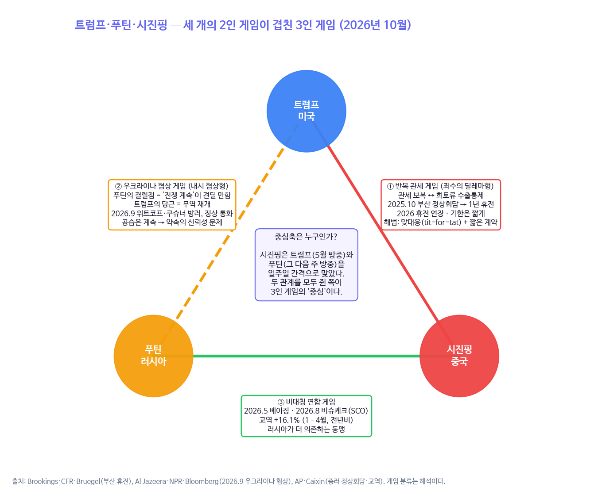

```{=html}
<style>
.cell-output-display img, figure img, .quarto-figure img { max-width:100% !important; height:auto !important; }
@media (max-width:640px){ .cell-output-display img, figure img { width:100%; } .figure-caption, figcaption { font-size:.82rem; } }
</style>
```

::: {.callout-note}
## 핵심 문장

내시의 1950년 협상 공식에서 결과를 정하는 것은 협상 테이블 위의 말이 아니라 **협상이 깨졌을 때 각자가 서 있는 자리(결렬점)**다. 알리샤 내시는 1963년 이혼과 자기 직장으로 결렬점을 키웠고, 그 힘으로 떠나는 대신 1970년 전남편을 다시 들였다. 2025~26년 미·중·러 세 정상의 관계도 같은 공식으로 읽힌다. 중국은 희토류로, 푸틴은 '견딜 만한 전쟁'으로 결렬점을 키웠다. 다른 점은 하나다. 알리샤는 키운 결렬점을 **협력의 담보**로 썼다.
:::

# 같은 날 본 두 장면

2026년 10월 5일, 영화 《뷰티풀 마인드》를 보고 내시의 연구와 그의 아내 알리샤의 삶을 하루 종일 따라갔다(자매편 [SP33 「영화가 지운 사람들」](sp33_people_the_film_erased.html), [HEARIM 특별편 제1호](https://waterfirst.pro/hearim/sp1/nash-family/ko/)). 저녁에는 한 질문이 남았다. **내시의 이론으로 알리샤의 삶을 읽을 수 있는가, 그리고 같은 렌즈로 오늘의 강대국 정상들을 읽을 수 있는가.**

이 글은 그림 세 장으로 그 질문에 답한다. 첫 장은 협상 공식, 둘째 장은 반복게임, 셋째 장은 3인 게임이다.

# 협상 공식: 결렬점이 몫을 정한다

내시는 1950년 『이코노메트리카』에 「협상 문제」를 냈다. 학부 국제경제학 수업 과제에서 시작한 논문이다. 공리 네 개(대칭성, 파레토 효율, 무관한 대안의 독립성, 효용 척도 불변성)를 받아들이면 협상의 결과는 하나로 정해진다.

> **합의점 = (내 몫 − 결렬 시 내 몫) × (상대 몫 − 결렬 시 상대 몫)을 최대로 하는 점**

이 공식의 핵심은 곱셈 안에 들어 있는 '결렬 시 몫'이다. 협상이 깨졌을 때 내가 덜 잃을수록 합의점은 내 쪽으로 온다. 오늘 모은 OpenAlex 자료에서 이 논문은 피인용 7,969회로, 유명한 균형점 논문(7,486회)보다 많이 인용됐다. 경제학이 실제로 가장 많이 가져다 쓴 내시의 도구는 이것이었다.

{fig-alt="사분원 모양 파레토 경계 위에서 1959년 결렬점의 합의점(알리샤 몫 0.63)과 1963년 결렬점의 합의점(0.81)을 비교한 개념도"}

1959년 알리샤는 출산을 앞두고 있었고 남편은 정신병원에 있었다. 떠날 곳이 없는 사람의 결렬점은 왼쪽 아래에 있다. 1963년 그녀는 이혼했고, RCA와 콘에디슨에서 일하며 혼자 아들을 키울 수 있게 됐다. 결렬점이 오른쪽으로 갔다. 그림 1에서 보듯 결렬점만 옮겨도 합의점은 그녀 쪽으로 따라온다.

그래서 1970년의 선택이 다르게 읽힌다. 영화는 '끝까지 곁을 지킨 아내'를 그렸지만, 기록 속 알리샤는 **떠날 수 있게 된 다음에 남기로 한** 사람이다. 결렬점이 낮은 사람이 남는 것은 인내지만, 결렬점이 높은 사람이 남는 것은 선택이다. 그녀는 갈 곳 없는 전남편을 '하숙인'이라는 새 계약으로 들였다. 재협상이었다.

# 반복게임: 지평이 길면 협력이 균형이 된다

한 번뿐인 죄수의 딜레마에서 합리적인 두 사람은 배신한다. 그런데 같은 게임을 끝없이 반복하고, 미래의 보상을 충분히 무겁게 여기면(할인율 δ가 높으면) 협력이 균형이 될 수 있다. 1970년대 프리드먼과 오먼 등이 정리한 이 결과(이른바 포크 정리)는 내시 균형 위에 세워진 것이지만, 내시 본인의 업적은 아니다.

{fig-alt="1950~2015년 연표. 위는 내시의 이론(1950 균형점·협상 해법, 1953 협조 게임, 1956 매장 정리, 1994 노벨상, 2008 대리인 방법, 2015 아벨상)과 1959~1990 투병, 아래는 알리샤의 결혼·간병, 이혼·독립, 하숙, 재혼, 그리고 1975년경부터 아들 조니 돌봄"}

알리샤의 지평은 56년(1959~2015)이었다. 그 사이 그녀가 한 일은 반복게임의 교과서와 닮았다. 협력하되(결혼·간병), 상대가 협력할 수 없을 때는 관계의 조건을 바꾸고(이혼), 다시 협력할 수 있는 형태로 계약을 고쳐 쓰고(하숙), 마지막에 원래의 형태로 돌아갔다(재혼). 그리고 그 내내 아들 조니를 돌봤다.

그림 2의 오른쪽 끝에는 아이러니가 있다. 노벨상 이후 내시가 마지막으로 매달린 연구는 '대리인 방법(2008~2012)', 즉 사람들이 결정을 남에게 맡기고 연합이 단계적으로 형성되는 **협력**의 모형이었다. 비협조 게임으로 이름을 얻은 사람이 여든에 도착한 곳에, 그의 아내는 수십 년 먼저 와 있었다.

# 3인 게임: 트럼프·푸틴·시진핑 (2026년 10월)

같은 렌즈를 오늘의 강대국 관계에 대 본다. 세 정상의 관계는 하나의 3인 게임이 아니라, 성격이 다른 **2인 게임 세 개가 겹친 것**으로 보는 편이 잘 맞는다.

{fig-alt="세 정상을 꼭짓점으로 한 삼각형. 미중은 반복 관세 게임, 미러는 우크라이나 협상 게임, 중러는 비대칭 연합 게임. 가운데에 시진핑이 두 관계를 모두 쥔 중심축이라는 설명"}

## 미·중: 반복 관세 게임

미국은 관세로, 중국은 희토류 수출통제로 맞보복했다. 2025년 10월 30일 부산 정상회담에서 두 정상은 1년짜리 휴전에 합의했다. 미국은 중국산 수입품 관세를 57%에서 47%로 내리고 펜타닐 관련 관세를 20%에서 10%로 낮췄으며, 중국은 최근의 희토류 수출통제를 1년 유예했다. 2026년 들어 휴전은 연장됐지만 기한은 짧게 잡혔다.

이것은 반복 죄수의 딜레마의 전형적인 해법이다. 상대가 협력하면 협력하고 배신하면 즉시 되갚는 **맞대응**, 그리고 배신의 유혹이 커지기 전에 다시 협상하게 만드는 **짧은 계약 기간**이다. 중국이 이 게임에서 몫을 지킨 방법은 그림 1과 같다. 희토류는 중국의 결렬점이었다. 협상이 깨져도 버틸 수 있고, 상대는 덜 버틸 수 있는 카드다.

## 미·러: 우크라이나 협상 게임

2026년 9월 초 위트코프 특사와 쿠슈너가 모스크바와 키이우를 차례로 찾았고, 9월 8일 트럼프는 푸틴과 한 시간 통화하며 전쟁을 끝내면 열릴 "인상적인" 무역 기회를 제시했다. 크렘린은 회담을 "실질적이고 매우 솔직하며 건설적"이라고 했다. 그러나 미국·우크라이나·유럽 정보당국은 푸틴의 의지를 여전히 의심했고, 사흘간 멈췄던 공습은 통화 직후 다시 시작됐다.

협상 공식으로 보면 문제는 결렬점에 있다. 푸틴에게 '전쟁 계속'은 견딜 만한 결렬점이다. 결렬점이 높은 쪽은 서두르지 않는다. 트럼프의 무역 당근은 합의점 쪽의 보상을 키우는 시도지만, 상대가 그 약속을 믿을 수 있는지(젤텐이 말한 '신뢰할 수 없는 약속'의 문제)가 남는다. 사흘 휴전 뒤의 공습은 그 신뢰성이 아직 서지 않았다는 신호다.

## 중·러: 비대칭 연합

푸틴은 2026년 5월 베이징을 찾았고, 8월 31일 비슈케크 상하이협력기구 정상회의에서 시진핑을 다시 만났다. 1~4월 양국 교역은 전년 대비 16.1% 늘었다. 그러나 이 연합은 대칭이 아니다. 서방 제재 아래 러시아가 중국에 더 기대는 구조다. 결렬점이 낮은 쪽은 러시아다.

## 중심축은 누구인가

2026년 5월 트럼프가 베이징을 방문했고, 그다음 주에 푸틴이 베이징을 찾았다. 시진핑은 일주일 간격으로 두 정상을 맞았다. 3인 게임에서 가장 유리한 자리는 다른 두 사람과 각각 관계를 맺고 있으면서 그 둘이 서로 덜 가까운 자리다. 미국이 러시아를 중국에서 떼어 내려는 이른바 '역(逆) 키신저' 구상이 쉽지 않은 이유도 여기 있다. 러시아에게 중국과의 관계를 버리는 것은 결렬점을 스스로 낮추는 일이기 때문이다.

# 경계에서만 나오는 명제

세 그림을 겹치면 하나의 명제가 남는다.

> **결렬점을 키운 쪽이 몫을 가져간다. 그러나 키운 결렬점을 무엇에 쓰는지는 공식이 정하지 않는다.**

게임이론만으로는 "결렬점이 몫을 정한다"에서 멈춘다. 가족사회학만으로는 "알리샤는 헌신했다"에서 멈춘다. 국제정치학만으로는 "강대국은 지렛대를 쌓는다"에서 멈춘다. 셋을 겹치면 차이가 보인다. 중국의 희토류와 푸틴의 전쟁은 결렬점을 **위협**으로 썼다. 알리샤는 같은 힘을 **협력의 담보**로 썼다. 떠날 수 있다는 사실이 남겠다는 약속을 믿게 만들었다. 반복게임에서 협력을 유지시키는 것이 바로 그 믿음이다.

# 이 글을 쓰는 동안

- 그림 1의 좌표(결렬점·합의점 값)는 실제 측정값이 아니다. 공식의 구조를 보이려고 넣은 가상의 값이며 그림과 본문에 그렇게 적었다.
- 처음 받은 외부 해설문은 "내시가 쿠르노·베르트랑 모형을 통합했다", "반복게임 담합을 규명했다"고 적었다. 확인해 보니 쿠르노 균형을 내시 균형으로 다시 읽은 것도, 반복게임의 포크 정리도 후대 경제학자들의 일이었다. 이 글은 그 구분을 따랐다.
- 미·중 휴전 연장의 정확한 만료일은 보도마다 표현이 달라 '연장, 기한은 짧게'로만 적었다.
- 그림 3의 사실 관계는 2025년 10월~2026년 9월 보도까지다.

::: {.callout-warning}
## 반대 해석 — 이 렌즈가 깨지는 곳

1. **사람은 공리대로 협상하지 않는다.** 내시 협상 해법은 대칭성과 '무관한 대안의 독립성'을 가정한다. 결혼은 사랑·책임·종교·아이가 얽힌 관계이고, 알리샤가 효용을 계산해 남았다는 증거는 없다. 그림 1·2는 구조를 보는 비유이지 그녀의 동기에 대한 설명이 아니다.
2. **결렬점 해석은 사후 합리화일 수 있다.** 이혼을 '결렬점을 키운 전략'으로 읽는 것은 결과를 아는 사람의 해석이다. 1963년의 알리샤에게 이혼은 아들을 지키기 위한 절박한 선택이었을 수 있다.
3. **정상들은 교과서의 경기자가 아니다.** 국내 정치, 선거, 체면, 건강, 측근의 정보가 보상표 밖에 있다. 트럼프의 관세는 협상 카드인 동시에 국내 정치의 메시지다.
4. **3인 게임은 셋으로 닫혀 있지 않다.** 우크라이나, 유럽, 인도, 북한, 그리고 한국 같은 다른 경기자가 결렬점을 바꾼다. 우크라이나는 그림 3에서 꼭짓점이 아니지만 미·러 협상의 결과를 실제로 쥐고 있는 당사자다.
5. **'중심축' 해석은 한 시점의 사진이다.** 일주일 간격의 정상회담은 상징적이지만, 그것만으로 영향력의 크기를 잴 수는 없다.
:::

# 남는 질문

알리샤 내시는 결렬점을 키운 다음 협력을 골랐다. 강대국들은 결렬점을 키운 다음 위협을 고른다. 둘의 차이는 지평의 길이일까, 아니면 서로를 '반복해서 만날 사람'으로 보느냐의 차이일까. 1년짜리 관세 휴전이 연장될 때마다, 그 질문을 다시 꺼내 볼 만하다.

# 참고 문헌

- Nash, J. F. (1950). The bargaining problem. *Econometrica* 18(2), 155–162.
- Nash, J. F. (1953). Two-person cooperative games. *Econometrica* 21(1), 128–140.
- Nash, J. F. et al. (2012). The agencies method for coalition formation in experimental games. *PNAS* 109(50), 20358–20363.
- Friedman, J. W. (1971). A non-cooperative equilibrium for supergames. *Review of Economic Studies* 38(1), 1–12.
- Selten, R. (1965). Spieltheoretische Behandlung eines Oligopolmodells mit Nachfrageträgheit. *Zeitschrift für die gesamte Staatswissenschaft* 121, 301–324.
- OpenAlex API 피인용 수, 2026-10-05 조회.
- Wikipedia, "Alicia Nash" (2026-10-05 접속); Nasar, S. (1998). *A Beautiful Mind*.
- Brookings, "What happened when Trump met Xi?"; CFR, "United States and China agree trade truce"; Bruegel, "The Trump–Xi summit: less a deal, more an uneasy truce"; Supply Chain Dive, "US to lower China tariffs as part of trade war truce" (2025).
- Al Jazeera (2026-09-05, 09-08); NPR (2026-09-06); Bloomberg (2026-09-09); CNN (2026-09-11) — 우크라이나 협상.
- AP via ADN (2026-05-19); Caixin (2026-02-05); 중국 외교부 (2026-09-03) — 중·러 정상회담.
- 자매편: Insight Lab SP33 「영화가 지운 사람들」; HEARIM 특별편 제1호 「세 개의 기록, 한 가정」.
