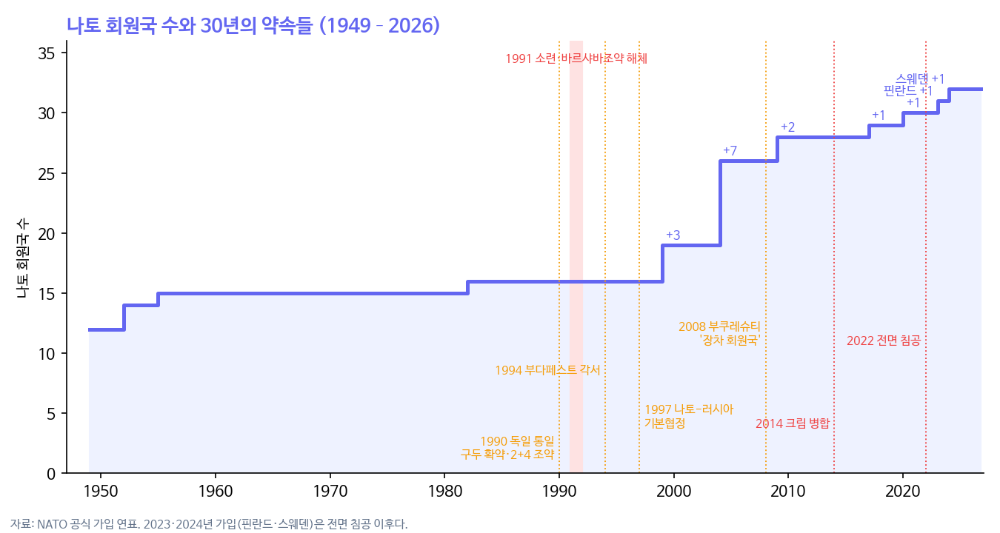
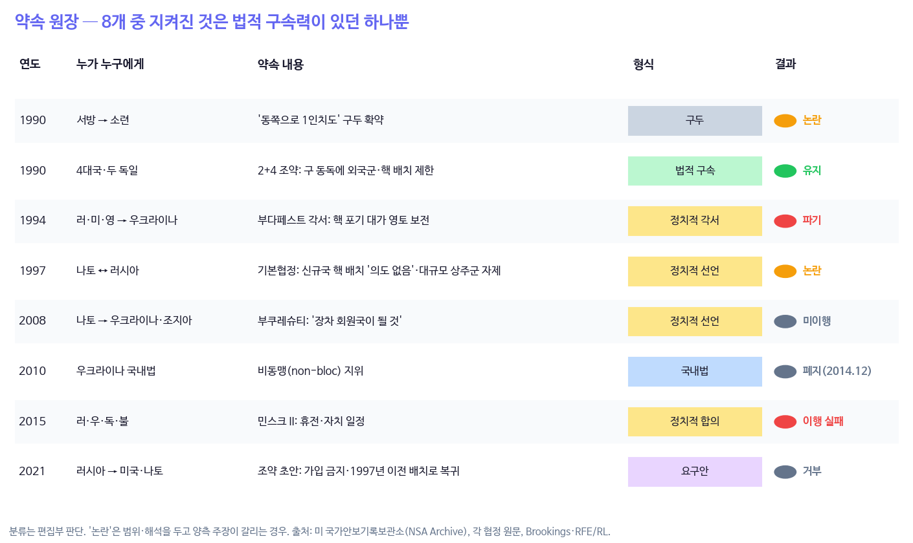

```{=html}
<style>
.cell-output-display img, figure img, .quarto-figure img { max-width:100% !important; height:auto !important; }
@media (max-width:640px){ .cell-output-display img, figure img { width:100%; } .figure-caption, figcaption { font-size:.82rem; } }
</style>
```

::: {.callout-note}
## 핵심 문장

1990년부터 2021년까지 러시아·서방·우크라이나 사이에 오간 약속 8개를 형식과 결과로 정리하면, 지켜진 것은 **법적 구속력이 있던 단 하나(2+4 조약)**뿐이었다. 구두 확약, 정치적 각서, 정치적 선언은 모두 논란이 되거나 깨지거나 실행되지 않았다. 게임이론에서 지켜도 그만 안 지켜도 그만인 약속은 '값싼 말'이고, 값싼 말은 균형을 바꾸지 못한다. 30년 동안 모두가 상대의 약속을 믿지 않는 법을 배웠다. **믿을 수 있는 약속이 없는 세계의 균형은 군비경쟁이고, 최악의 경우 전쟁이다.** 그러나 이 렌즈는 누가 옳은지를 판정하지 않는다. 무력 사용의 책임은 국제법이 묻는다.
:::

# 하나의 서사, 두 개의 독법

독일 통일에서 우크라이나 전쟁까지를 다섯 단계로 정리한 글이 돌고 있다. 소련이 독일 통일을 양보했고, 서방은 "동쪽으로 1인치도" 가지 않겠다고 했지만, 나토는 다섯 차례 14개국으로 넓어졌고, 2008년 우크라이나에 가입을 약속했고, 2014년 크림 병합과 2022년 전면 침공으로 이어졌다는 줄거리다.

이 줄거리는 대체로 사실에 기대고 있지만, 러시아의 시각에 가깝다. 같은 30년을 동유럽 국가들은 "러시아로부터의 탈출"로 기억한다. 이 글은 어느 쪽 서사를 고르기 전에, 두 서사가 공유하는 구조를 게임이론으로 읽는다. 자매편 [SP34 「결렬점을 쥔 사람」](sp34_who_holds_the_threat_point.html)에서 쓴 렌즈의 연장이다.

{fig-alt="1949년 12개국에서 2024년 32개국까지 나토 회원국 수 계단 그래프. 1990 독일 통일, 1994 부다페스트 각서, 1997 나토-러시아 기본협정, 2008 부쿠레슈티, 2014 크림 병합, 2022 전면 침공 표시"}

# 다섯 단계, 다섯 개의 개념

## 1990년: 결렬점이 무너진 쪽의 양보와 '값싼 말'

1990년의 소련은 협상이 깨지면 더 잃는 쪽이었다. 경제는 무너지고 동독 정권은 이미 내려앉고 있었다. 내시 협상 해법에서 결과를 정하는 것은 협상이 깨졌을 때 각자가 설 자리(결렬점)이고, 결렬점이 낮은 쪽은 양보한다.

1990년 2월 9일 베이커 미 국무장관은 고르바초프에게 미국이 나토 틀 안에서 독일에 남는다면 "나토의 현재 군사 관할이 동쪽으로 1인치도 확장되지 않는다"는 보장이 중요하다고 세 번 말했다. 미국 국가안보기록보관소(NSA Archive)가 2017년 공개한 문서들은 이것이 1990~91년 서방 지도자들의 연쇄적 확약 중 하나였다고 본다. 반면 미 국무부는 이 발언이 동독 지역에 관한 것이었다고 해석한다. 정작 최종 조약(2+4 조약, 1990년 9월)에 박힌 것은 **구 동독 지역의 외국군·핵 배치 제한**뿐이었다.

게임이론은 이런 말을 **값싼 말(cheap talk)**이라 부른다. 말하는 데 비용이 없고 지키지 않아도 대가가 없는 신호다. 크로퍼드와 소벨(1982)은 이해관계가 엇갈리는 상대 사이의 값싼 말이 전달할 수 있는 정보에 한계가 있음을 보였다. 값싼 말은 분위기를 바꿀 수 있지만 균형을 바꾸지는 못한다. 고르바초프 자신도 2014년 인터뷰에서 "그때는 나토 확대라는 주제 자체가 논의되지 않았다"고 말하면서, 동시에 확대가 1990년 합의의 "정신"에 어긋난다고 덧붙였다. 양쪽 모두가 이 인터뷰를 인용한다.

## 1991~2020년: 안보 딜레마

동유럽 각국에게 나토 가입은 최선의 대응이었다. 러시아에 지배당한 역사를 가진 나라에게 집단방위는 러시아 앞에서의 결렬점을 끌어올린다. 러시아에게 같은 사건은 상대 동맹이 국경으로 오는 것이었다.

저비스(1978)의 **안보 딜레마**는 이 구조를 설명한다. 한쪽이 방어를 위해 한 행동을 다른 쪽이 공격으로 읽고, 그 대응을 다시 처음 쪽이 공격으로 읽는다. 양쪽 모두 합리적인데 양쪽 모두 더 불안해진다. 반복되는 죄수의 딜레마에서 상대의 협력을 믿을 수 없을 때 나오는 균형이다.

여기에 하사니의 **불완전 정보 게임**이 겹친다. 서로 상대가 어떤 '유형'인지 모른다. 러시아는 방어적인 강대국인가 팽창하려는 제국인가. 나토는 방어 동맹인가 포위망인가. 각자의 믿음이 최선의 대응을 정하고, 그 대응이 다시 상대의 믿음을 강화한다.

## 2008년: 자극할 만큼 강하고, 막을 만큼 믿을 수 없는 약속

부쿠레슈티 정상회의는 우크라이나와 조지아가 "장차 나토 회원국이 될 것"이라고 선언했다. 그러나 가입 일정도, 집단방위의 보호도 주지 않았다.

젤텐의 **부분게임 완전성**으로 보면 최악의 중간값이다. 실행 일정이 없는 약속은 믿을 수 없다(신뢰할 수 없는 약속). 그런데 그 약속은 러시아에게 "가입이 실현되기 전에 막아야 한다"는 유인을 줄 만큼은 강했다. 억지력 없는 도발이다. 같은 해 8월 러시아-조지아 전쟁이 일어났다.

## 2014년: 깨진 약속은 상대를 더 멀리 보낸다

다섯 단계 서사에서 빠진 약속이 하나 있다. **1994년 부다페스트 각서**다. 우크라이나는 당시 세계 3위 규모였던 핵무기를 넘기는 대가로 러시아·미국·영국으로부터 영토 보전과 독립의 존중을 약속받았다. 2014년 러시아는 크림반도를 병합했다.

같은 해의 또 다른 사실도 서사에서 빠져 있다. 크림 병합 당시 **우크라이나는 법적으로 비동맹국이었다.** 2010년 야누코비치 정부가 군사동맹 가입을 추구하지 않는다는 '비동맹(non-bloc) 지위'를 법으로 정했고, 우크라이나 의회가 이를 폐지한 것은 병합 뒤인 2014년 12월 23일이었다(찬성 303표).

게임이론으로 읽으면, 약속을 지키지 않은 상대를 경험한 쪽은 다음부터 값싼 말 대신 **값비싼 신호**(동맹 가입, 무장)를 찾는다. 러시아의 행동이 우크라이나를 서방으로 밀었고, 우크라이나의 서방행이 다시 러시아의 위협 인식을 키우는 나선이 시작됐다.

## 2021~2022년: 합리적인 나라들은 왜 전쟁을 하는가

전쟁은 양쪽 모두에게 손해다. 같은 결과를 협상으로 얻을 수 있다면 전쟁은 비합리적이다. 그럼에도 전쟁이 일어나는 이유를 피어런(1995)은 셋으로 정리했다.

1. **사적 정보와 허세의 유인.** 각자 자기 결의와 능력을 상대보다 잘 알고, 더 좋은 조건을 얻으려 과장할 유인이 있다. 러시아는 우크라이나의 저항을 과소평가했다.
2. **약속 문제(commitment problem).** 힘의 균형이 앞으로 바뀔 것이 예상될 때, 강해질 쪽은 "지금 약속한 것을 나중에도 지키겠다"고 믿게 만들 수 없다. 러시아는 지금 중립을 약속받아도 우크라이나가 강해지면 뒤집을 것이라 봤고, 서방은 영구 중립을 약속할 수도, 하려 하지도 않았다. 믿을 만한 약속이 없을 때 예방 전쟁이 '합리적'으로 보인다.
3. **나눌 수 없는 쟁점.** 서방은 각국의 동맹 선택권을 나눌 수 없는 원칙으로 다뤘고, 러시아의 2021년 12월 조약 초안(우크라이나 가입 금지, 나토 배치를 1997년 이전으로 되돌릴 것)은 합의 가능한 범위 밖에 있었다.

세 조건 중 이 30년의 줄거리에 가장 잘 맞는 것은 두 번째, 약속 문제다.

# 약속 원장

{fig-alt="8개 약속 표. 1990 구두 확약 논란, 1990 2+4 조약 유지, 1994 부다페스트 각서 파기, 1997 기본협정 논란, 2008 부쿠레슈티 미이행, 2010 비동맹법 2014.12 폐지, 2015 민스크 II 이행 실패, 2021 러시아 조약 초안 거부"}

그림 2는 이 글의 데이터다. 8개 중 '유지'는 하나다. 구두 확약과 정치적 선언은 해석 다툼이 됐고, 정치적 각서와 합의는 깨지거나 이행되지 않았다. 1997년 나토-러시아 기본협정에서 나토는 신규 회원국 영토에 핵무기를 배치할 "의도도, 계획도, 이유도 없다"고 했고, 집단방위는 대규모 전투병력의 추가 상주가 아닌 다른 방식으로 하겠다고 적었다. 그러나 2014년 이후 동유럽의 순환 배치 증강을 두고 다시 논란이 됐다. 2021년 러시아가 요구한 "1997년 이전으로의 복귀"가 바로 이 협정을 가리킨다.

# 경계에서만 나오는 명제

> **값싼 말이 쌓이면 서로의 약속을 믿지 않는 법을 배운다. 그때부터 남는 신호는 값비싼 것뿐이다 — 동맹, 무장, 그리고 전쟁.**

게임이론만으로는 "약속 문제가 있었다"에서 멈춘다. 국제정치학만으로는 "안보 딜레마의 나선이었다"에서 멈춘다. 국제법만으로는 "조약과 정치적 각서는 구속력이 다르다"에서 멈춘다. 셋을 겹치면 구조가 보인다. 30년 동안 당사자들은 반복해서 **구속력 없는 형식으로 가장 중요한 것을 약속했다.** 그리고 그 약속들이 깨질 때마다 상대는 다음 약속을 덜 믿게 됐고, 말 대신 행동으로 신호를 보내기 시작했다. 반복게임에서 협력이 유지되려면 배신이 관찰되고 처벌될 수 있어야 하는데, 구속력 없는 약속은 배신의 정의 자체를 다툼거리로 만든다.

# 이 글을 쓰는 동안

- 원래 받은 다섯 단계 글에는 1994년 부다페스트 각서와 2010~14년 우크라이나의 비동맹법이 빠져 있었다. 두 사실은 서사의 방향을 바꿀 수 있어 따로 확인해 넣었다(Brookings, RFE/RL, TASS 보도).
- "동쪽으로 1인치도"의 범위는 NSA Archive(서방 확약이 동유럽 전반에 걸쳤다는 해석)와 미 국무부(동독에 한정)가 다르게 본다. 이 글은 어느 한쪽을 사실로 확정하지 않았다.
- 그림 2의 초안은 민스크 II를 '파기'로 분류했다. 양측이 서로 위반을 주장하는 사안이라 '이행 실패'로 고쳤다. 제목도 "법적 구속력이 있던 약속만 지켜졌다"에서, 그런 약속이 1건뿐이라는 점을 드러내도록 "8개 중 지켜진 것은 법적 구속력이 있던 하나뿐"으로 바꿨다.

::: {.callout-warning}
## 반대 해석 — 이 렌즈가 깨지는 곳

1. **게임이론은 책임을 판정하지 않는다.** 이 글은 "각자 합리적이어도 왜 모두 나빠지는가"를 설명할 뿐이다. 유엔 헌장의 무력 사용 금지와 주권 존중이라는 국제법의 기준으로는 2014년 병합과 2022년 침공의 책임은 그것을 실행한 쪽에 있다. 구조적 설명을 면책으로 읽으면 안 된다.
2. **'나토 확대가 원인'이라는 독법에 맞지 않는 사실들.** 우크라이나는 2014년 병합 당시 비동맹국이었다. 2008년 이후 2021년까지 우크라이나의 가입 일정은 한 번도 잡히지 않았다. 고르바초프는 1990년에 확대 문제가 논의되지 않았다고 했다. 이 사실들은 안보 딜레마보다 영토·정체성 쪽의 동기를 가리킬 수 있다.
3. **동유럽 국가들은 장기판의 말이 아니다.** 폴란드·발트 3국의 가입은 나토가 밀어붙인 것이 아니라 그 나라들이 요청한 것이다. 2인 게임(러시아 대 서방)으로 그리면 이 국가들의 선택이 사라진다. SP33에서 본 "보상표 밖의 사람들"이 여기서는 나라 단위로 반복된다.
4. **결과가 반대 방향을 가리킨다.** 전면 침공 뒤 핀란드와 스웨덴이 가입했다. 안보 딜레마의 처방이 "상대를 자극하지 말라"라면, 이 사례는 침공이 오히려 가장 원치 않던 확대를 불렀음을 보여 준다. 러시아가 자기 결렬점을 스스로 깎은 수다.
5. **원장은 표본이 작고 분류가 주관적이다.** 8개 약속 선정과 '논란·이행 실패' 분류는 편집부 판단이다. 다른 약속(예: 1975년 헬싱키 최종의정서, 1990년 파리 헌장)을 넣으면 그림이 달라질 수 있다.
:::

# 남는 질문

SP34에서 본 것처럼 2026년 9월에도 미·러 사이에는 우크라이나를 두고 특사가 오가고 정상 통화가 이어진다. 이번 협상에서 나올 약속은 어떤 형식일까. 30년의 원장이 남긴 교훈이 하나 있다면, 무엇을 약속하느냐만큼 **어떤 형식으로 약속하느냐**가 그 약속의 수명을 정한다는 것이다.

# 참고 문헌

- National Security Archive (2017). "NATO Expansion: What Gorbachev Heard." George Washington University.
- Gorbachev, M. (2014). Russia Beyond the Headlines 인터뷰; gorby.ru 게재본(2014-11-21).
- Treaty on the Final Settlement with Respect to Germany (2+4 조약, 1990).
- Budapest Memorandum on Security Assurances (1994).
- Founding Act on Mutual Relations, Cooperation and Security between NATO and the Russian Federation (1997).
- NATO Bucharest Summit Declaration (2008), para. 23.
- Pifer, S. (2014). "Ukraine overturns its non-bloc status: What next with NATO?" Brookings; RFE/RL (2014-12-23).
- Crawford, V. & Sobel, J. (1982). Strategic information transmission. *Econometrica* 50(6), 1431–1451.
- Jervis, R. (1978). Cooperation under the security dilemma. *World Politics* 30(2), 167–214.
- Fearon, J. D. (1995). Rationalist explanations for war. *International Organization* 49(3), 379–414.
- Selten, R. (1975). Reexamination of the perfectness concept for equilibrium points in extensive games. *International Journal of Game Theory* 4, 25–55.
- NATO, "Member countries" 공식 가입 연표.
- 자매편: Insight Lab SP33 「영화가 지운 사람들」, SP34 「결렬점을 쥔 사람」.
