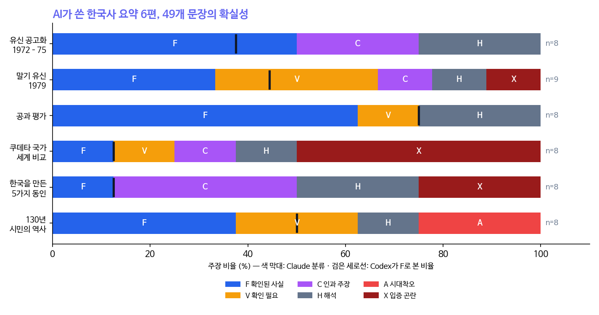
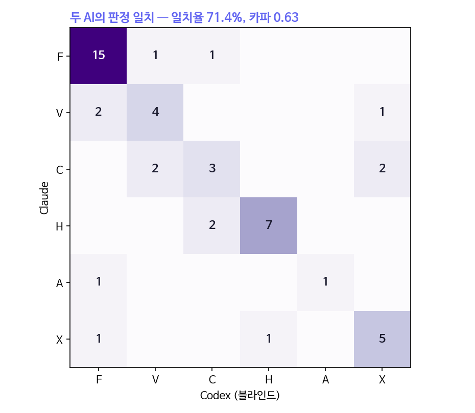

```{=html}
<style>
.cell-output-display img, figure img, .quarto-figure img { max-width:100% !important; height:auto !important; }
@media (max-width:640px){ .cell-output-display img, figure img { width:100%; } .figure-caption, figcaption { font-size:.82rem; } }
</style>
```

::: {.callout-note}
## 핵심 문장

AI가 쓴 한국 현대사 요약 6편에서 핵심 문장 49개를 뽑아, 역사학 석사논문 지도에 쓰는 기준(확인된 사실·확인 필요·인과·해석·시대착오·입증 곤란)으로 두 AI가 따로 분류했다. 일치율 71.4%(카파 0.63). 두 AI 모두 같은 경향을 봤다. **구체적 사건을 다룬 글은 확인된 사실이 절반 안팎이었지만, 세계 비교와 "한국을 만든 동인"으로 갈수록 그 비율이 12.5%로 떨어졌다.** 그리고 검토를 맡은 AI는 "원문으로 확인된다"고 쓰고서 틀렸다. 같은 방법을 1974년 육영수 피격 사건에 적용하면, 52년의 논란은 '누가 배후냐'보다 **어느 사료가 무엇을 입증할 수 없느냐**의 문제로 다시 보인다.
:::

# 영화 한 편과 요약 여섯 편

2026년 9월 영화 「암살자(들)」이 개봉하자 1974년 8월 15일이 다시 뜨거워졌다. 그 열기 속에서 한 사람이 AI에게 유신 시대를 차례로 물었고, AI는 매끈한 요약을 여섯 편 내놓았다. 유신의 공고화, 말기 유신과 10·26, 박정희의 공과, 쿠데타 국가들과의 세계 비교, "한국을 다르게 만든 5가지 동인", 그리고 동학부터 2024년 계엄까지의 130년.

읽기에는 모두 그럴듯했다. 문제는 그럴듯함이 근거가 아니라는 데 있다. 이 글은 두 가지를 한다. 첫째, 그 요약들을 역사학의 방법으로 감사한다. 둘째, 같은 방법으로 1974년 사건 자체를 다시 읽는다.

# 방법 — 석사논문 지도에서 가져온 도구

이 방법은 2026년 8월 역사학 석사논문을 준비하던 학생을 지도하며 정리한 가이드에서 왔다. 원칙은 단순하다. 학생이 연구자이고, AI는 조사표와 반론을 만든다. 검색 결과와 원문 확인은 다르며, 당대 사료와 후대 회고는 다르다. 그리고 작성자 AI와 검토자 AI는 같은 파일을 만지지 않는다.

도구도 그때의 툴킷을 썼다. 논리 설계용 MCP(sequential-thinking)와 학술 교차검증용 MCP(arXiv)를 이번에 다시 설치했다. 핵심은 도구보다 **분류 기준**이다.

| 기호 | 범주 | 뜻 |
|---|---|---|
| F | 확인된 사실 | 판결·공문서·복수의 1차 자료로 확인 |
| V | 확인 필요 | 출처 후보는 있으나 원문 미확인, 또는 증언 하나에 의존 |
| C | 인과 주장 | 선후관계를 넘어 원인을 주장 — 연결 사료가 필요 |
| H | 해석·작업가설 | 경쟁 설명과 반증 가능성이 필요 |
| A | 시대착오 위험 | 후대 개념·문구를 당대에 투사 |
| X | 입증 곤란 | 현재 사료로 입증 곤란하거나 반례가 있음 |

: **표 1.** 주장 분류 기준(역사학 석사논문 AI 연구지도 가이드의 2단계). 원자료 `output/data/sp36/claims.json`, `codex_labels.json`.

절차는 이렇다. Claude가 여섯 편에서 핵심 문장 49개를 뽑아 분류했다. Codex에게는 **Claude의 분류를 보여 주지 않고** 같은 기준과 문장만 줬다. 가이드가 '독립 반론 검토자'에게 요구한 블라인드 조건이다. 둘이 갈리면 AI끼리 토론시키지 않고, 사람이 원문으로 판정한다.

# 49문장의 확실성

{fig-alt="6편별 F·V·C·H·A·X 비율 가로 막대. 유신 공고화 F 50%, 말기 유신 33%, 공과 평가 62.5%, 쿠데타 국가 세계 비교 12.5%, 5가지 동인 12.5%, 130년 37.5%."}

전체 49문장 중 Claude가 확인된 사실로 본 것은 17개(35%)였다. 더 흥미로운 것은 **글의 종류에 따른 기울기**다.

- 구체적 사건과 인물을 다룬 글(유신 공고화, 말기 유신, 공과 평가)은 확인된 사실이 33~63%였다.
- "쿠데타 국가와 세계 비교"와 "한국을 만든 5가지 동인"은 둘 다 **12.5%** — 8문장 중 1문장뿐이었다. 나머지는 인과 주장, 해석, 그리고 반례가 있는 단정이었다.
- 이 기울기는 Codex의 블라인드 분류에서도 똑같이 나왔다(검은 세로선: 공과 평가 75%, 세계 비교·5가지 동인 12.5%).

요약이 '왜'를 말하기 시작하면 확인된 사실은 줄고 그 자리를 인과와 해석이 메운다. 문장은 오히려 더 단호해진다. "오직 한국만", "완전히 배척", "영구히 사라졌다" 같은 표현이 모두 이 구간에서 나왔다. 2024년 12월 3일 계엄 하나만으로도 "군을 정치에서 완전히 배척했다"는 문장은 반례를 얻는다.

{fig-alt="6×6 교차표. F-F 15, H-H 7, X-X 5, V-V 4, C-C 3, A-A 1이 일치. 일치율 71.4%, 카파 0.63."}

두 AI는 49개 중 35개에서 같은 판정을 냈다(일치율 71.4%, 우연 일치를 뺀 카파 0.63 — 통상 '상당한 일치'로 읽는 구간). 불일치 14개는 대부분 이웃한 범주 사이였다. 인과(C)냐 확인 필요(V)냐, 해석(H)이냐 인과(C)냐. 이것은 오류라기보다 기준의 경계가 원래 흐릿하다는 뜻이다.

## 검토자도 틀린다

불일치 하나는 성격이 달랐다. "1919년 임시정부 헌법 1조에 '대한민국은 민주공화국이다'를 명시했다"는 문장을 Claude는 **시대착오(A)**로, Codex는 **확인된 사실(F)**로 봤다. Codex의 근거는 "임시헌장 원문으로 확인된다"였다.

원문을 다시 봤다. 1919년 4월 11일 대한민국 임시헌장 제1조는 **"대한민국은 민주공화제로 함"**이다. "민주공화국이다"는 1948년 제헌헌법의 문구다. 뜻은 이어지지만 문장은 다르다. 검토를 맡은 AI가 '원문으로 확인된다'고 쓰면서 원문과 다른 문장을 사실로 판정한 것이다.

이 장면이 이 글의 방법론적 결론이다. AI 두 대를 붙이면 오류가 줄지만, **최종 판정은 원문을 직접 본 사람의 몫**으로 남는다. 가이드가 "학생 원문 확인: [미확인]/[확인]" 칸을 사료카드 맨 아래에 따로 둔 이유다.

# 같은 방법으로 1974년 8·15를 읽는다

## 사료카드 — 무엇을 입증하고, 무엇을 입증할 수 없나

| 사료 | 생산 주체·시점 | 당대/후대 | 입증할 수 있는 것 | 입증할 수 없는 것 |
|---|---|---|---|---|
| 판결문(1974.10~12) | 한국 법원 | 당대 | 문세광의 발사·유죄, 공식 총성 7발 구분 | 육 여사 치명탄과 문세광 총의 탄도 대조(공개 기록 없음) |
| 주한미국대사관 전문 20건(1974.8.15~12.21, 2026.8 공개) | 미국 대사관(제3자) | 당대 | 당일 정부 내 정보 혼선, 9.4 보고의 "자백 의존·독립 확인 부족" 평가 | 수사의 실체·배후 |
| 일본 경찰 수사·1975 경찰백서 | 일본 경찰(타국) | 당대 | 권총 절도 확인, 조총련 연계 증거 불충분 판단, 자금 출처 미규명 | 한국 내 수사 과정 |
| 국가기록원 주제설명 | 한국 정부 기관 | 후대 정리 | 한·일 결론의 차이(일본: "소영웅주의자의 단독범행") | 원자료 자체 |
| 김기춘 미발간 회고록(2009) | 당시 수사 검사(당사자) | 후대 회고 | 일본 공동수사 거절을 본인이 주도했다는 진술, 그 이유("진술이 바뀔 우려") | 거절의 실제 효과, 진술 변경 가능성의 실체 |
| 이건우 증언(1989~) | 당시 감식계장(당사자) | 후대 회고 | 공식 탄착 순서와 다른 본인 기억 | 탄환 귀속 |
| 2005 녹음 분석(배명진) | 대학 연구자 | 후대 분석 | 녹음상 총성 7회, 4번째 총성 0.17초 뒤 피격자의 움직임 | 어느 총의 탄환이 맞혔는지 |
| CIA 1985 내부 문건 | 미 정보기관 | 후대 정리 | 문세광을 "북한 공작원"으로 표기한 사실 | 독자 재조사 여부 |
| TIME 「The Accidental Assassination」(1974.8.26) | 미국 시사주간지 | 당대 | 대통령이 연단으로 돌아가 연설을 이어간 사실, 그날 밤 임종을 지킨 사실, 동정 여론 예측 | 연설을 이어간 동기 |
| 이상렬 수행과장 인터뷰(2026.10) | 당시 경호실 수행과장(측근) | 후대 회고 | 총격 직후 "이군, 집사람 봐!" 외침, 행사 뒤 "집사람만 챙겨" 지시라는 본인 기억 | 대통령의 내면·상황 인식 |

: **표 2.** 1974년 8·15 관련 주요 사료의 사료카드 요약. 가이드 3단계 양식에서 '입증할 수 있는 주장 / 입증할 수 없는 주장 / 당대 기록·후대 회고' 칸만 추렸다.

이 표를 세로로 읽으면 하나의 구멍이 보인다. **'입증할 수 없는 것' 칸에 같은 항목이 반복된다 — 치명탄.** 당대 사료 중 탄두를 회수해 넘기고, 보관하고, 총과 대조하는 연쇄를 보여 주는 것이 공개돼 있지 않다. 법과학에서 말하는 증거의 보관 연쇄가 끊긴 자리다. 이후 52년의 의혹은 거의 모두 이 한 자리에서 자랐다.

## 경쟁가설과 반증 조건

가이드 5단계는 가설마다 "어떤 사료가 나오면 이 가설이 틀렸다고 판단할 것인가"를 먼저 적으라고 한다.

| 가설 | 주장 | 이 가설을 무너뜨릴 사료 |
|---|---|---|
| H1 한국 공식 결론 | 문세광 실행, 북한·조총련 지령 | 자백 외의 독립 증거(자금 흐름·통신 기록)가 끝내 없음이 확인되는 경우, 일본 측 수사 원자료가 지령을 부정하는 경우 |
| H2 일본 결론 | 문세광의 단독범행 | 조총련·북한의 지령·자금을 보여 주는 당대 문서 |
| H3 경호원 탄 가설 | 문세광 실행, 치명탄은 경호원 쪽 | 치명탄 탄두와 문세광 권총의 탄도 대조 기록 |
| H4 정권 개입설 | 권력기관의 기획·묵인 | 미 대사관 전문이 보여 준 당일의 혼선 — 이미 이 가설과 배치되는 당대 증거가 있음 |

: **표 3.** 경쟁가설과 반증 조건.

## 가장 이상한 장면 — 설득력과 증거력

관객이 가장 이상하게 여기는 장면은 따로 있다. 아내가 머리에 총을 맞고 실려 나가는 동안 대통령은 연단으로 돌아가 경축사를 끝까지 읽었다. 1974년 TIME이 그렇게 적었다(표 2). 경호 관점에서도 비정상이다. 공범 여부도 모르는 상황에서 대통령이 단상을 지켰다.

그러나 이 장면을 표 3에 대 보면 판별력이 거의 없다. 단독범이어도, 북한 배후여도, 경호원 탄이어도, 권력 개입이어도 "의연한 국가원수"를 연출하려는 행동은 똑같이 일어날 수 있다. 어느 가설이 맞든 일어날 확률이 비슷한 증거는 어느 가설도 밀어 주지 않는다. 반대로 탄두·탄도 기록은 관객에게 지루하지만 가설을 가르는 힘이 가장 크다.

**사람들은 가장 이상해 보이는 장면에서 의심하고, 진실은 가장 지루한 서류에서 가려진다.** 설득력과 증거력이 거꾸로 놓인 것, 이것이 52년 논쟁의 구조다. 다만 연설 장면이 보여 주는 것이 없지는 않다. 그 시대가 국가의 의례를 한 사람의 생명보다 앞세웠다는 것 — 이 비판은 배후 논쟁과 무관하게 성립한다.

표 3에서 H4만 이미 불리한 당대 증거를 안고 있다. 각본이 있었다면 경호실과 정보기관이 범인의 이름조차 다르게 보고하지는 않았을 것이다. 반면 H1·H2·H3를 가를 결정적 사료는 **아직 공개되지 않았다.** 그래서 52년 동안 결론 대신 논쟁이 이어졌다. 영화가 건드린 곳도 정확히 이 미공개 지점이다.

# 경계에서만 나오는 명제

> **확실성은 문장의 어조가 아니라 사료의 연쇄에서 나온다. 그리고 연쇄가 끊긴 자리일수록 요약은 더 단호해진다.**

역사학만으로는 "당대 사료와 후대 회고를 구분하라"에서 멈춘다. 측정이론만으로는 "평가자 간 일치도가 0.63이다"에서 멈춘다. 법과학만으로는 "보관 연쇄가 끊겼다"에서 멈춘다. 셋을 겹치면 하나의 패턴이 보인다. 1974년 사건에서 의혹이 자란 곳은 증거 연쇄가 끊긴 치명탄이었고, AI 요약에서 단정이 늘어난 곳은 사료로 연결되지 않는 '왜'의 구간이었다. **증거의 공백은 침묵을 낳지 않고 확신을 낳는다** — 음모론 쪽에서도, 매끈한 요약 쪽에서도.

# 이 글을 쓰는 동안

- 문헌조사용 MCP 두 개(sequential-thinking, arXiv)를 다시 설치했다. arXiv는 이공계 위주라 한국 현대사 교차검증에는 얕다. 실제 확인은 국사편찬위원회 전자사료관, 국가기록원, 언론 보도 원문으로 했다.
- Codex의 출력 파일 끝에 'DONE'이 붙어 JSON이 깨졌다. 마지막 줄을 떼고 읽었다.
- 블라인드 분류에서 Codex가 1919년 임시헌장 문구를 사실로 판정한 것을, 원문 확인으로 바로잡았다. 이 판정은 Claude 쪽 손을 들어 준 것이지만, Claude의 분류도 같은 방식의 원문 대조를 거치지 않은 문장이 많다는 점을 밝혀 둔다.
- 연설 장면의 근거로 Codex는 TIME 기사를 인용했는데, 확인해 보니 그 링크는 2012년 기사(「The Dictator's Daughter」)였다. Claude도 처음엔 이를 당대 기사로 잘못 받아들였다. 같은 TIME의 1974년 8월 26일 기사를 따로 찾아 당대 근거로 교체했다. 인용의 날짜를 확인하지 않으면 후대 서술이 당대 사료로 둔갑한다.
- 49문장은 Claude가 뽑았다. 어떤 문장을 고르느냐가 이미 결과에 영향을 준다(아래 반대해석 3).

::: {.callout-warning}
## 반대 해석 — 이 측정이 말하지 못하는 것

1. **요약에 단정이 많은 것은 장르의 성격일 수 있다.** 세계 비교나 '동인' 분석은 원래 인과와 해석의 글이다. 확인된 사실 비율이 낮은 것은 결함이 아니라 질문의 종류 때문일 수 있다. 문제는 해석이 있는 것이 아니라, 해석을 사실의 어조로 쓴 것이다.
2. **카파 0.63은 두 AI의 일치이지 정답과의 일치가 아니다.** 두 AI가 같은 방향으로 틀릴 수 있다. 실제로 둘 다 '확인된 사실'로 본 15문장도 원문 대조를 모두 거치지는 않았다.
3. **표본이 작고 선택이 개입됐다.** 6편·49문장이고, 문장 선택과 첫 분류를 모두 Claude가 했다. 다른 사람이 뽑으면 기울기가 달라질 수 있다.
4. **사료카드의 '입증할 수 없는 것'은 '공개 자료로'라는 단서가 붙는다.** 수사 기록 원본, 경호실 기록이 공개되면 표 2와 표 3의 판정은 바뀐다. 이 글은 미공개 자료가 무엇을 담고 있을지 추측하지 않는다.
5. **방법이 결론을 대신하지 않는다.** 사료비판은 어떤 가설이 약한지를 보여 줄 뿐, 유족과 사회가 겪은 상처의 무게를 재지 않는다. 장봉화라는 이름이 기록에서조차 흐릿하다는 사실은 이 표들 어디에도 칸이 없다.
:::

# 남는 질문

52년 전 한 수사 검사는 일본 수사관이 오면 진술이 바뀔까 봐 문을 닫았다. 오늘 우리는 두 AI를 서로 모르게 하여 판정이 바뀌는지를 본다. 같은 문제를 거꾸로 다루는 셈이다. 진술이 흔들릴까 봐 검증을 막는 쪽과, 흔들리는지 보려고 검증을 붙이는 쪽. 역사가 우리에게 남긴 방법론은 결국 이 차이 하나일지 모른다.

# 참고 문헌

- AI Agent 역사학 석사논문 연구지도 가이드(2026.8) — https://waterfirst.github.io/openai-fde-prep/guides/AI_AGENT_HISTORY_THESIS_GUIDE.html
- 국사편찬위원회 전자사료관, 1974 주한미국대사관 비밀문서(2026.8 공개); 중앙일보 '이팩트' 보도.
- 국가기록원 주제설명 「육영수 여사 저격 사건」.
- 주간경향(2026.9), 김기춘 미발간 회고록 보도.
- JBC뉴스 「7발의 미스터리」, 프레시안 「5대 미스터리」, 캐나다 한국일보, 연합뉴스, 뉴시스, 한국일보.
- TIME (1974.8.26). South Korea: The Accidental Assassination. https://time.com/archive/6878054/south-korea-the-accidental-assassination/
- JBC뉴스(2026.10), 이상렬 전 경호실 수행과장 인터뷰.
- 대한민국 임시헌장(1919.4.11) 제1조; 대한민국 헌법(1948) 제1조.
- Landis, J. R. & Koch, G. G. (1977). The measurement of observer agreement for categorical data. *Biometrics* 33(1), 159–174 — 카파 해석 구간.
- 자매편: Culture Voyager 「암살자(들) — 0.17초를 둘러싼 52년」; Insight Lab SP35 「약속이 값싼 말이 될 때」.
