```{=html}
<style>
.cell-output-display img, figure img, .quarto-figure img { max-width:100% !important; height:auto !important; }
@media (max-width:640px){ .cell-output-display img, figure img { width:100%; } .figure-caption, figcaption { font-size:.82rem; } }
</style>
```

::: {.callout-note}
## 핵심 문장

1974년 8월 15일 국립극장 저격 장면으로 유튜브에 도는 영상 4개를 미 연방수사국(FBI)식 증거 검사 절차로 해부했다. 결과는 세 가지다. **첫째, 4개는 독립 증거가 아니라 한 원본의 사본이다**(음향 상관 0.81–0.96). **둘째, 이 원본 계통에서는 총성이 한 발도 검출되지 않는다.** 대신 11.0초에 하울링(마이크 피드백)으로 보이는 412Hz 순음이 있고, 전원 험(60Hz)은 사건 구간에서 끊기지 않는다. **셋째, 화면이 보여 주는 것은 순서뿐이다.** 무대 위 인물이 먼저 움직이고, 약 2초 뒤 연설자가 연단 뒤로 사라지고, 그로부터 약 1초 뒤 한복 차림 인물이 화면 오른쪽으로 기운다. 그러나 누가 치명탄을 쐈는지는 이 영상으로 판별할 수 없다. 이 글의 명제는 경계에서 나온다. **음향학은 증거가 무엇을 말하는지보다 무엇을 말할 수 없는지를 수치로 정한다. 그 한계선을 넘는 순간 사료비판은 음모론이나 정사(正史) 중 하나로 미끄러진다.**
:::

# 의뢰와 범위

2026년 9월 영화 「암살자(들)」이 개봉한 뒤, 1974년 8·15 사건의 영상이 다시 대량으로 공유되고 있다. 의뢰는 단순했다. "당시 저격 영상을 유튜브에서 찾아서 직접 분석하라. FBI 조사법으로."

이 보고서는 그 의뢰에 대한 검사 보고서다. 사건의 진상을 판정하는 문서가 아니다. **공개 영상이 증거로서 무엇을 입증할 수 있고 무엇을 입증할 수 없는지**를 측정으로 정한다. 형식은 FBI 사건 보고 관행과, 디지털 증거 과학작업반(SWGDE)의 영상·음향 검사 지침, 정보분석의 경쟁가설분석(ACH)을 따랐다. 신뢰도 표현은 미국 정보공동체 지침(ICD-203)의 높음·중간·낮음을 썼다.

| 용어 | 뜻 |
|---|---|
| 확인 | 측정으로 재현됨(이 보고서에서는 **사본 안에서** 재현됨) |
| 부합 | 가설과 모순 없음, 단정 불가 |
| 배제 불가 | 반증 증거 없음 |
| 판정 불가 | 이 증거로는 답할 수 없음 |
| 미검출 | 찾았으나 기준을 넘는 신호가 없음 — "없음"과 다르다 |

: **표 1.** 판정 용어. "미검출"과 "없음"을 구분하는 것이 이 보고서 전체의 핵심 규칙이다.

## 공조 검사 체계

검사는 한 AI의 단독 판단이 되지 않도록 역할을 나눴다(R-GT 원칙: 검사 분리, 결함 찾기가 성공).

| 검사자 | 역할 | 결과 |
|---|---|---|
| Claude | 주 검사, 측정, 보고서 작성 | 본문 |
| Codex (gpt-5.5) | **블라인드 재측정** — 내 수치를 보여 주지 않고 같은 파일로 처음부터 | 4개 사건 중 3개 일치, 1개는 Codex 측 오측정(4.6절) |
| DeepSeek (v4-pro, 추론) | **레드팀** — 보고서 초안의 논리 결함 탐색, 물리 검산 | 지적 6건 수용, 초안의 결론 3개 철회(9절) |
| Gemini (CLI, 웹검색) | 1차 사료 수색 | **전량 폐기** — 인용 URL 검증 결과 날조(4.7절) |

: **표 2.** 공조 검사 체계. 산출물 원본은 `output/data/sp37/`.

# 기준 기록(K) — 무엇과 대조하는가

FBI 관례대로 출처가 확인된 기준 기록(K, Known)과 검사 대상(Q, Questioned)을 분리한다.

- **K1 확정판결·공식 발표.** 총성은 7발이다. 문세광이 5회 격발했다: ① 자기 허벅지 오발 ② 연단 ③ 불발 ④ 육 여사 우측 두부 ⑤ 태극기 근처. 나머지는 경호원 응사 2발이고, 그중 1발에 합창단원 장봉화 양이 사망했다. 판결문은 문세광이 "약 18.2미터 전방 단상"의 육 여사를 향해 쐈다고 적었다(프레시안 2005 인용).
- **K2 배명진(숭실대 소리공학연구소) 2005년 분석.** SBS 「그것이 알고싶다」와 MBC 「이제는 말할 수 있다」 의뢰로 수행됐다.
  - 음원: "CBS·KBS·MBC와 미국 CBS 등 TV·라디오의 현장자료".
  - 결론: 7발 중 1·2·3·5번째가 문세광, 4·6·7번째가 경호원이다. 첫 총성부터 4번째까지 6.91초가 걸렸고, 그 0.17초 뒤(7.08초) 육 여사가 움직였다.
- **K3 이건우 전 서울시경 감식계장(1989년 월간 「다리」).** 현장검증에서 탄흔은 4개를 찾았지만 탄두는 하나도 찾지 못했다. 극장 소도구 주임이 "어젯밤 청와대에서 다 쓸어갔다"고 말했다고 한다. — **증언이며 미검증.**

# 증거 목록과 보관연속성

| 번호 | 유튜브 ID | 게시 채널 / 게시일 | 규격 | 길이 | SHA-256 |
|---|---|---|---|---|---|
| Q1 | JABHMSoi1bU | 조국과 민족을 위하여 / 2023-04-22 | AV1 640×480 30fps, Opus 48kHz | 77.3s | `944b7194…0221d40` |
| Q2 | F-bDTTL8r2M | 박선생의 텔레비전 / 2021-12-18 | AV1 854×480 30fps | 185.4s | `32ad8525…7f07f436e` |
| Q3 | O65Kl05hB84 | 이교덕 / 2022-12-13 | AV1 854×480 30fps | 51.4s | `51bad417…241c5d85bef` |
| Q4 | EwkcM0MYYyY | 고원식 / 2022-08-10 | VP9 640×360 29.97fps | 183.7s | `a643c012…f8d4ca33` |

: **표 3.** 검사 대상. 수집 2026-10-06 07:27(yt-dlp). 해시 전체값과 ffprobe 원자료는 `output/data/sp37/evidence.json`. 영상 파일 자체는 저작권 때문에 재배포하지 않는다. 같은 ID로 받아서 해시를 대조하면 검증할 수 있다.

- Q4는 TV 화면을 휴대폰으로 다시 찍은 사본이라 화면 분석에서 뺐고, 음향 계통 대조에만 썼다.
- 주 분석 대상은 원본에 가장 가까운 Q1이다. 보정(샤프닝·노이즈 제거)은 하지 않았다.
- **보관연속성의 공백.** 4점 모두 1974년 원본 이후의 경로(방송 → 녹화 → 디지털화 → 업로드)가 기록돼 있지 않다. 법정 기준으로 진정성(authentication)이 입증되지 않은 증거다. **아래의 모든 "확인"은 "이 사본 안에서"라는 단서를 단다.**

# 검사 결과

## 출처 계통 — 사본 4점은 증거 1점이다

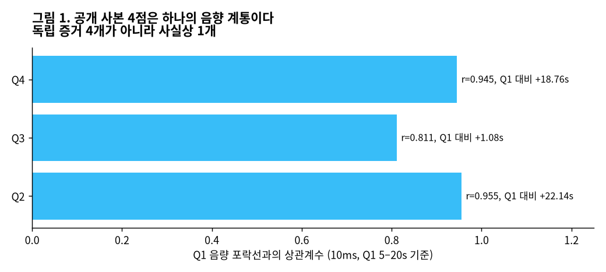{fig-alt="사본 간 음향 상관"}

방법: 각 사본의 음량 포락선(10ms 단위 RMS의 로그값)을 만든 뒤, Q1의 5–20초 구간을 다른 사본 전체에 대고 상관을 계산했다.

| 사본 | 상관계수 | Q1 대비 시간 오프셋 |
|---|---|---|
| Q2 | 0.955 | +22.14s |
| Q4 | 0.945 | +18.76s |
| Q3 | 0.811 | +1.08s |

: **표 4.** 원자료 `lineage.json`. Codex의 블라인드 재측정(8kHz, 50ms 창)도 같은 오프셋 22.14s·1.08s를 얻었다. 상관계수 크기는 방법 차이로 더 낮게 나왔다.

**판정 — 확인, 신뢰도 높음.** 네 영상은 같은 음향 원본에서 나왔고, Codex 확인 결과 추가 카메라 각도도 없다. 영상끼리 맞춰 보는 것은 독립 확인이 아니다. 인터넷에서 "여러 영상이 똑같이 보여 준다"는 말은 증거의 수를 부풀린다.

## 음향 대역 — 총성을 담기 어려운 그릇

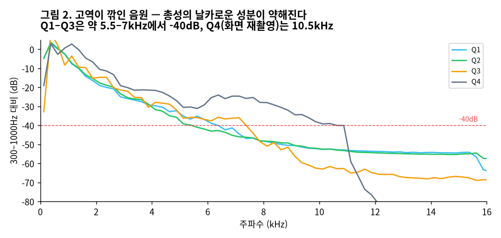{fig-alt="사본별 주파수 대역"}

Q1–Q3은 4kHz에서 -28~-32dB, 약 5.5–7kHz에서 -40dB까지 감쇠한다(`bandwidth.json`). Codex 측정으로는 95% 스펙트럼 롤오프가 **1.36kHz**다. 1970년대 방송 테이프 수준의 강한 고역 감쇠다.

총성의 식별 특징인 수 밀리초짜리 날카로운 앞부분은 고역 에너지가 대부분을 차지한다. 이 그릇에서는 그 특징이 뭉개진다. 아래에서 총성이 "미검출"이라고 할 때, 이 사실은 **위음성(있는데 못 찾음) 가능성**으로 함께 읽어야 한다.

## 사건 구간 타임라인

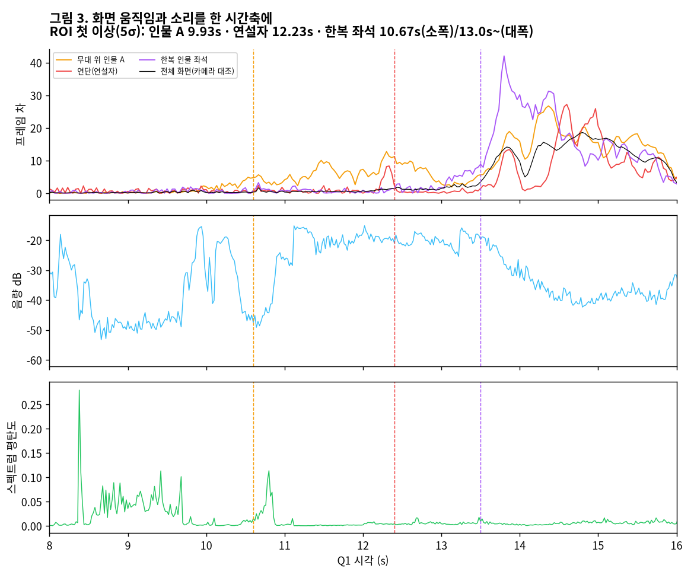{fig-alt="관심영역 움직임, 음량, 평탄도"}

방법: 30fps 흑백 프레임에서 관심영역(ROI) 셋의 프레임 간 평균 절대차를 구했다. 연단 연설자, 연설자 오른쪽 좌석의 무대 위 인물 A, 한복 차림 인물의 좌석이다. 기준선은 5–9.5초 구간이고, 기준선의 중앙값+5σ를 넘는 첫 시각을 기록했다. 카메라 움직임을 걸러내는 대조군으로 전체 화면 값도 함께 그렸다(`roi_motion.json`). 이 구간에서 중복 프레임은 0개였다. 실효 30fps이고 시간 분해능은 33ms다.

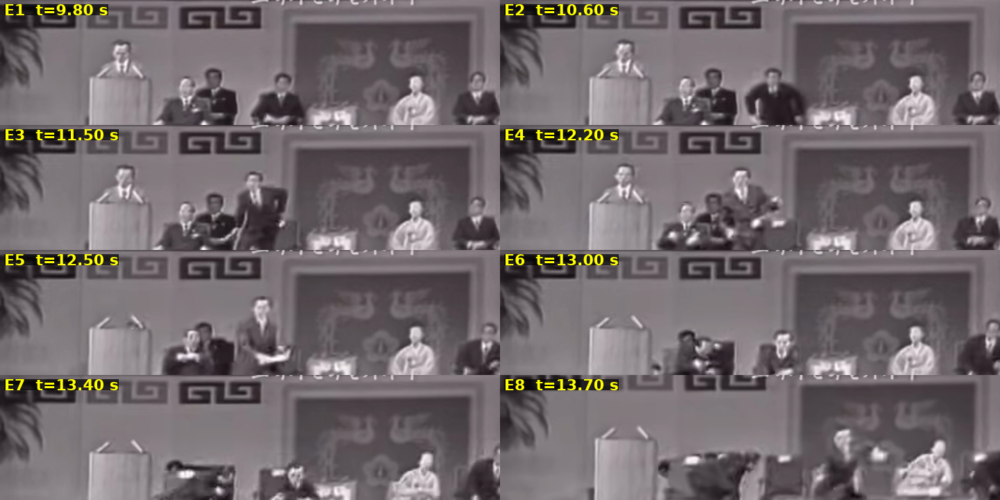{fig-alt="핵심 프레임 E1–E8"}

**증거판 E1–E8** (Q1 확대, 시각은 Q1 기준)

| 시각 | 증거 | 관찰 |
|---|---|---|
| 9.80 | E1 | 연설 중. 무대 위 인사들 착석. 한복 차림 인물은 연단 오른쪽 뒤에 착석 |
| 9.93–10.67 | ROI, E2 | 무대 위 인물 A가 **가장 먼저** 움직여 일어난다. 신원은 판독하지 않는다 |
| 11.50 | E3 | 인물 A가 서서 연단 쪽으로 이동. 연설자는 계속 서 있다 |
| 12.20 | E4 | 인물 A가 팔을 수평으로 뻗은 자세. **무기를 쥐었는지는 판독 불가** |
| 12.23–12.50 | ROI, E5 | **연설자 은신**. 12.30에 숙이고, 12.40에 정수리만 보이고, 12.50에 연단에 마이크 2개만 남는다 |
| 13.00 | E6 | 주변 인사들 은신. 한복 차림 인물은 착석 정자세 |
| 13.40 | E7 | 한복 차림 인물 여전히 착석 |
| 13.50–13.57 | ROI, E8 | 한복 차림 인물이 **화면 오른쪽으로** 기울고, 인물 1명이 그쪽으로 달려간다. 13.47부터 카메라가 크게 흔들린다 |

: **표 5.** 사본 안의 사건 순서. 간격: 인물 A 반응 → 연설자 은신 약 2.3s, 연설자 은신 → 한복 인물 이상 동작 약 0.8–1.3s.

**판정 — 사본 안의 순서는 확인(신뢰도 높음, 검사자 2명 독립 측정). 1974년 실제 사건의 순서로는 조건부.** 연설자가 은신한 뒤 약 1초 동안 한복 인물 쪽으로 엄호하는 동작은 화면에 **보이지 않는다.** 이건 관찰이다. "경호 실패 입증"으로 올리는 것은 당시 경호 지침이 없는 상태에서는 규범적 판단이라 하지 않는다(9절, 철회 2).

## 총성 탐지 — 미검출

탐지에는 네 가지 방법을 함께 썼다.

1. 1·2·5ms 단위로 음량이 급하게 뛰는 지점(onset)을 검출
2. 2.5kHz 하이패스 필터
3. 20ms 단위 스펙트럼 평탄도 — 총성은 넓은 대역에 고르게 퍼져 높고, 목소리는 배음 구조 때문에 낮다
4. 파형 직접 판독

판정 기준은 FBI·법음향 문헌의 일반 특징을 따랐다: **상승시간 2ms 미만, 넓은 대역, 빠른 감쇠.**

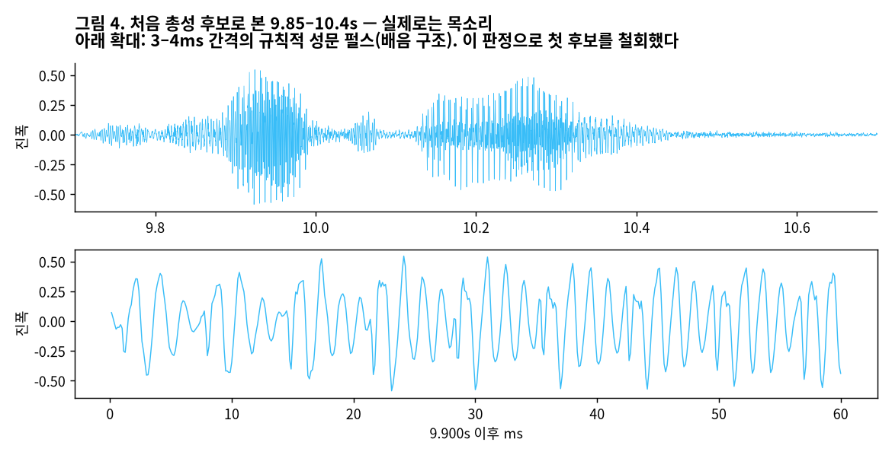{fig-alt="9.7–10.7초 파형"}

**첫 후보의 철회.** 처음 확대 분석에서 9.8–10.4초의 두 덩어리를 총성 후보로 봤다. 확대해 보니 3–4ms 간격의 규칙적인 성문 펄스였고, 스펙트로그램에는 음높이가 휘는 배음 묶음이 나왔다. **목소리다.** 이 정정은 9절에 기록했다.

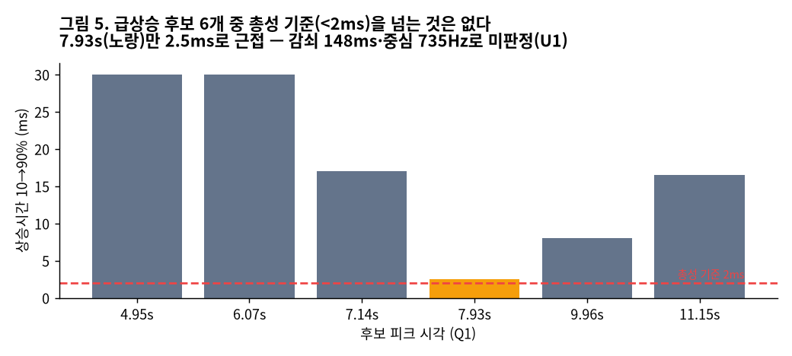{fig-alt="급상승 후보 상승시간"}

| 후보(Q1) | 상승시간 | 판정 |
|---|---|---|
| 4.95s | 30ms | 어절 시작 |
| 6.07s | 30ms | 어절 시작 |
| 7.14s | 17ms | 어절 시작 |
| **7.93s** | **2.5ms** | **미판정 U1**: 감쇠 148ms, 중심 735Hz, 2–6kHz가 -25.6dB, 주기성 0.29. 파열음 또는 원거리 충격음. 그 시각 무대 위 반응 없음 |
| 9.96s | 8ms | 목소리 |
| 11.10s | 16.5ms | 함성 시작 |

: **표 6.** 원자료 `impulse_candidates.json`, `manual_records.json`. Codex의 독립 탐지(상승 <2ms, 1–16kHz 광대역, -20dB 감쇠 <180ms를 동시에 요구)도 기준을 넘는 후보 0개였다. 유일한 근접 후보 19.61s(상승 1.19ms)는 8–16kHz가 -34dB라서 기각됐다.

음량이 큰 11.1–13.8s 구간은 평탄도 중앙값이 0.003으로 낮다. 배음 구조가 있는 사람 소리(함성·비명)와 하울링이다(다음 절).

**판정 — 이 계통에서 총성 미검출(신뢰도 높음). 이것을 총성이 없었다는 증거로 쓰지 않는다.** 이유는 셋이다. 고역 감쇠(4.2절), 송출 단계의 자동 음량 조절(AGC)이나 리미터 가능성(최대 진폭 약 0.6, 클리핑 0%), 그리고 관객석에서 난 소리가 연단 마이크에 얼마나 잡혔는지 계산할 수 없다는 점이다. 결국 "총성 7발"은 공개 계통으로 **재현할 수도 반박할 수도 없다.**

## 하울링 — 412Hz 순음

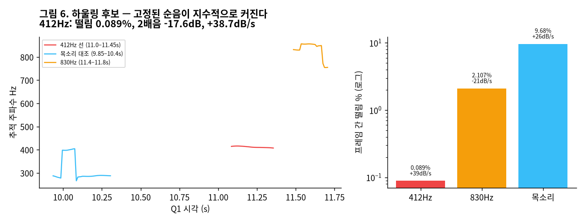{fig-alt="하울링 후보 주파수 추적"}

방법: 8192점 FFT, 10ms 간격으로 피크 주파수를 포물선 보간해 추적하고, 2·3배음 비를 함께 쟀다(`howling.json`).

| 지표 | 412Hz 선 (11.0–11.45s) | 830Hz (11.4–11.8s) | 목소리 대조 (9.85–10.4s) |
|---|---|---|---|
| 평균 주파수 | 412.0Hz | 832.1Hz | 312.5Hz |
| 총변동 | 2.11% | 12.27% | 44.22% |
| 프레임 간 떨림 | **0.089%** | 2.107% | 9.68% |
| 2배음 / 3배음 | **-17.6 / -25.6dB** | -26.1 / -36.8dB | +3.1 / -5.5dB |
| 진폭 기울기 | **+38.7dB/s** | -21.2dB/s | +25.9dB/s |

: **표 7.** 하울링 판별. 하울링(음향 피드백)은 음높이가 고정된 순음이 지수적으로 커진다는 특징이 있다.

**판정 — 412Hz 선은 하울링과 부합(신뢰도 중간).** 대안은 길게 끄는 비명이나 호루라기인데, 사람 목소리의 떨림(9.7%)과 100배 차이가 나서 가능성이 낮다. 830Hz 구간은 고음 비명에 가깝다.

하울링이 수사에 주는 의미는 세 가지다.

1. **하울링을 총성으로 오인했을 가능성은 낮다.** 하울링은 수백 ms 이어지고 총성은 수 ms다. 다만 음량 포락선만으로 총성을 세는 방법이라면 하울링의 시작점이 펄스로 잡힐 수 있다. 배명진 분석의 방법론을 확인해야 한다.
2. **총성이 가려졌을 가능성은 부분적으로 있다.** 하울링이 생기면 송출단 AGC가 이득을 낮추고, 11.0–11.5s 무렵의 충격음 크기가 줄어든다. 그러나 하울링 **이전**인 10.4–10.9s의 조용한 구간(-45~-50dB)에 아무것도 없는 이유는 설명하지 못한다.
3. **원본을 찾으면 시간 기준점이 된다.** 하울링은 연단 마이크가 장내 확성 계통과 연결돼 있었다는 표지다. 여러 음원에 공통으로 찍혔을 것이므로, 원본 음원 여러 개를 확보하면 서로 맞추는 기준이 된다.

## 전력망 주파수(ENF) — 편집 흔적 검사

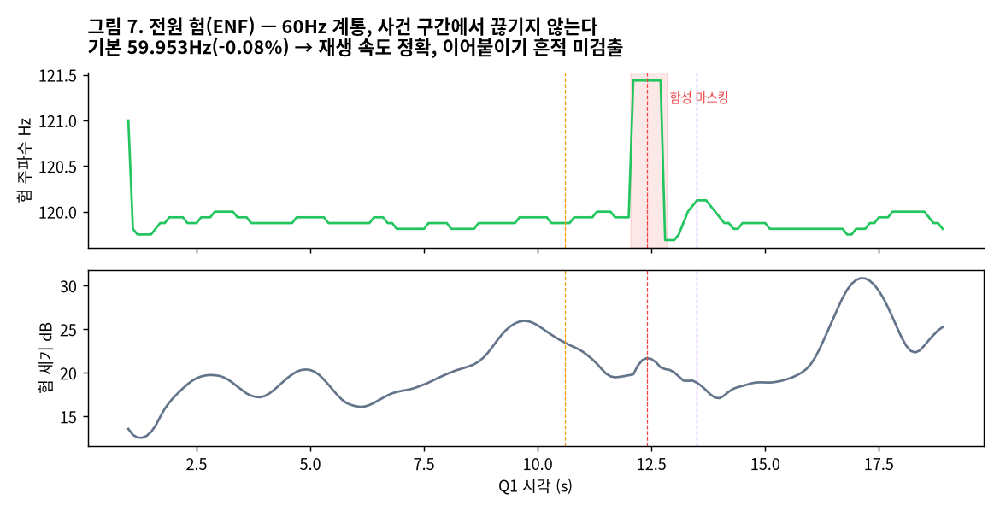{fig-alt="전원 험 추적"}

아날로그 녹음에는 전원 험(hum)이 섞인다. 험 주파수는 전력망을 따라 조금씩 흔들리기 때문에, 녹음에 험이 남아 있으면 그 연속성으로 편집 여부를 본다. FBI와 유럽 법과학기관이 쓰는 ENF 분석이다.

- 험 기본파는 **59.953Hz**(돌출 16.9dB)이고, 배음 120Hz(19.1dB)·240Hz(13.6dB)도 있다(`enf.json`). 60Hz 전력망의 아날로그 계통이다.
- 공칭 60Hz와의 차이는 **-0.08%**다. 디지털화할 때 테이프 재생 속도가 거의 정확했다는 뜻이고, **이 사본의 초 단위 측정은 0.1% 이내로 유효하다.** 단, 험이 1974년 현장에서 들어온 것인지 이후 재생 단계에서 들어온 것인지는 구분할 수 없다.
- 120Hz 추적(2초 창): 0–20s 동안 119.75–120.1Hz로 연속이다. 12.1–12.8s에서만 탐색 상한으로 튀는데, 험 세기가 떨어지지 않았으므로 함성이 험을 덮은 **마스킹**이다.

**판정 — 9–13s에서 험의 불연속(이어 붙이기·시간 압축) 미검출. 영상 편집 가설은 약하게 불리해진다(신뢰도 낮음~중간).** 2초 창의 해상도와 재압축본이라는 한계가 있다.

## 검사자 간 대조 — 블라인드 재측정

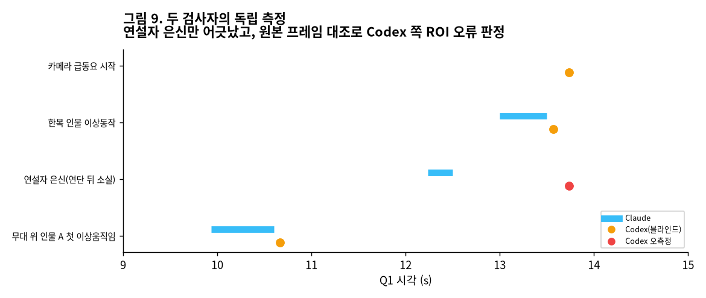{fig-alt="Claude와 Codex 측정 비교"}

Codex는 내 수치를 보지 않고 측정했다(`codex_visual_results.json`). 무대 위 인물 A의 첫 반응(10.667s), 한복 인물의 이상 동작(13.567s, 화면 오른쪽 기울기), 카메라 동요는 일치했다.

어긋난 것은 **연설자 은신**이다. Codex는 13.733s, 나는 12.23–12.5s였다. 원본 프레임을 대조해 보니 Codex의 ROI 박스가 연설자가 아니라 **연단 위 벽의 무늬**에 놓여 있었고, 13.733s의 카메라 이동에 반응한 것이었다.

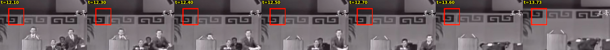{fig-alt="연설자 은신 판정 프레임, 빨간 박스는 Codex ROI"}

**교훈.** 블라인드 재측정은 일치를 확인하는 데만 쓰는 게 아니다. 서로의 측정 도구 결함을 드러내는 데 가치가 있다. 이번에는 상대 쪽 결함이었지만, 같은 절차로 내 쪽 결함도 드러날 수 있다(실제로 레드팀이 그렇게 했다. 9절).

## Gemini 사료 수색의 폐기

Gemini는 판결문, 수술의 소견, 국과수 감정서, 미 국무부 전문의 "원문 인용"과 URL을 내놨다. 인용된 URL을 직접 열어 대조했다.

| 인용 URL | 실제 페이지 제목 |
|---|---|
| news.kbs.co.kr ncd=702958 | 「칸 박사, 이란에 원심 분리기 제공」 |
| ohmynews A0000245648 | 「5주간 의식불명 플로리다 남성 '기적'의 재생」 |
| yna AKR20050220038900001 | (빈 페이지) |
| imnews 2018 4619728 | (빈 페이지) |

: **표 8.** 원자료 `manual_records.json`. 네이버 뉴스라이브러리 3건은 기사 번호 실재를 확인하지 못했다. NYT는 접근이 차단됐다(403).

"B열 214번 좌석", "사입구 우측 두정부 1cm", "탄두 4개 강선 일치" 같은 구체적 인용은 **한 줄도 쓰지 않는다.** 검색형 AI의 인용은 URL을 열어 보기 전까지 증거가 아니다. 이건 SP36에서 확인한 "그럴듯함은 근거가 아니다"를 다시 확인한 것이다.

# 배명진(2005) 분석과의 대조

## 물리 검산

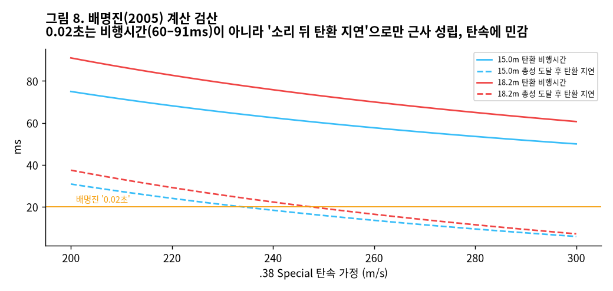{fig-alt="탄속별 비행시간과 지연"}

배명진 분석의 계산: 거리 15–18.2m, 탄속 250m/s, 음속 340m/s일 때 "3번째 총격에 맞았다면 총알은 0.02초 후 단상에 도달하고, 미동까지 0.15초가 더 걸린다."

- 탄환 **비행시간**은 15–18.2m에서 **60–73ms**(탄속 250m/s)다. 0.02초를 비행시간으로 읽으면 틀린다.
- "총성이 연단 마이크에 도착한 뒤 탄환이 도착하기까지의 지연"으로 읽으면 16–19ms로 근사적으로 맞는다.
- .38 Special 탄속을 200–300m/s 범위로 잡으면 이 지연은 **6–38ms**로 퍼진다.
- "+0.15초"는 물리량이 아니라 생리 반응 가정이다.

검산은 DeepSeek이 하고 Claude가 다시 계산해 일치를 확인했다. **결론: 0.17초 논증은 탄속 가정에 민감하다. 단일 값으로 "4번째 총성"을 특정하는 것은 과잉이다.**

## 시간 간격의 충돌

| | 기준점 | 끝점 | 간격 |
|---|---|---|---|
| 배명진 | 첫 총성 | 육 여사 미동 | **7.08s** |
| 본 검사(Q1) | 무대 위 첫 반응 9.93–10.67s | 이상 동작 13.0–13.57s | **2.3–3.6s** |

두 값이 맞으려면 첫 총성(오발)이 Q1 기준 약 6.0–6.5초에 있어야 한다. 그 구간은 연설 어절이고(상승 17–30ms), 무대 위 반응도 없다(4–9.75s 프레임 정지 확인). 미판정 후보 U1(7.93s)을 첫 총성으로 놓아도 간격은 5.6s로 맞지 않는다.

DeepSeek 레드팀은 이 충돌을 설명할 수 있는 시나리오 일곱 개를 냈다.

- S1: 기준점이 다르다(첫 반응 ≠ 첫 총성)
- S2: "미동"과 "기울어짐"은 서로 다른 사건이다
- S3: 음향이 비동기이거나 교체됐다
- S4: 방송 처리로 첫 총성이 가려졌다
- S5: 프레임 삭제나 시간 압축이 있다
- S6: 배명진의 펄스 분류가 틀렸다
- S7: 첫 총성에 대한 화면 반응이 늦었다

ENF 연속(4.5절)은 S5를 약하게 불리하게 만든다. 나머지는 **배명진이 쓴 원음을 확보해야 판별된다.** 배명진은 CBS 라디오와 미국 CBS 음원도 썼으므로, 공개 유튜브 계통과는 **다른 음원**에 근거했을 가능성이 높다(신뢰도 중간).

# 방송 3사 기록

1974년 당시 방송사는 KBS·MBC·TBC(동양방송)였고 라디오로 CBS가 있었다. SBS는 1990년 개국이다. TBC 자료는 1980년 언론 통폐합 때 KBS로 넘어갔다. 기념식은 생중계됐고, 범인을 제압하는 동안 방송이 끊겼다가 재개됐다. Q1의 20–28초 검은 화면이 이것과 부합한다.

| 방송사 | 프로그램 | 방송일 | 내용 |
|---|---|---|---|
| SBS | 그것이 알고싶다 「누가 육영수 여사를 쏘았는가」 | 2005-02-12, 03-26 | 배명진 7발 분석, 현장 재현 |
| MBC | 이제는 말할 수 있다 87회 「중앙정보부는 문세광을 알았다」 | 2005-03-20 | 수사본부장 김일부 인터뷰. 2026-09-28 PD수첩 유튜브에 재공개 |
| MBC | 같은 프로그램 88회 「문세광을 이용하라」 | 2005-03-27 | 정치적 이용 축 |
| SBS | 그것이 알고싶다 「문세광은 진범이 아닐 수 있다?」 | 2020-01-31 | 남은 의혹 |
| SBS | 꼬꼬무 시즌2 | 2021-04 | 생중계 영상, 장봉화 양 |
| KBS | 독자적 탐사 재조사 프로그램은 확인하지 못했다 | — | 대신 원본 테이프(자체분 + TBC 이관분) 보유 가능성이 가장 높은 곳 |

: **표 9.** 방송 기록. 출처는 참고문헌.

# 경쟁가설 분석 (ACH v2)

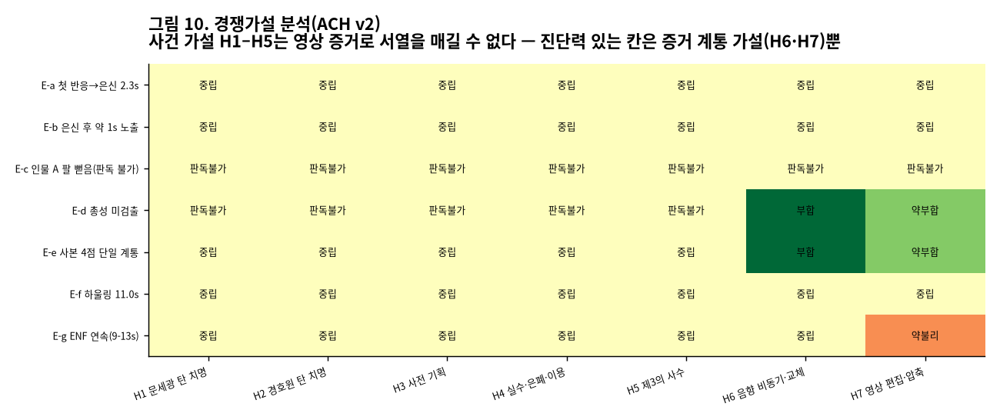{fig-alt="경쟁가설 매트릭스"}

가설:

- H1 문세광 탄이 치명탄(공식 결론)
- H2 경호원 탄이 치명탄
- H3 사전 기획(자작극)
- H4 실수 → 은폐 → 정치적 이용
- H5 제3의 사수
- H6 음향 비동기·교체(증거 계통 가설)
- H7 영상 편집·시간 압축(증거 계통 가설)

초안에서는 "연설자가 2.3초 늦게 은신했다"를 H3에 약하게 불리하다고 판정했다. 레드팀 지적을 받아들여 삭제했다. 사전에 알았다면 즉시 피했을 것이라는 **행동 추정에 기댄 판정이라 진단력이 없기** 때문이다. 모든 가설에 똑같이 들어맞는 증거(E-a, E-b)는 ACH에서 중립이다.

**판정: 사건 가설 H1–H5는 공개 영상으로 서열을 매길 수 없다.** 진단력이 있는 칸은 증거 계통 가설(H6·H7)에만 있다. 영상이 사건보다 **영상 자신에 대해** 더 많이 말한다는 뜻이다.

# 결론

1. 공개 영상 4점은 한 계통이다. — 확인, 신뢰도 높음
2. 사본 안의 순서: 인물 A 반응(9.9–10.7s) → 연설자 은신(12.3–12.5s) → 주변 은신 → 한복 인물 착석 유지 → 13.5s 화면 오른쪽으로 기울어짐. — 사본 기준 확인(검사자 2명), 1974년 사건 기준은 조건부
3. 총성은 이 계통에서 미검출이다. 위음성 가능성이 크고, "7발"은 재현도 반박도 불가하다. — 신뢰도 높음
4. 11.0s 하울링 후보가 있고, 9–13s에서 ENF 불연속은 미검출이다. — 각각 신뢰도 중간, 낮음~중간
5. 치명탄의 사수, 자작극 여부, 경호원 탄 여부는 **모두 이 영상으로 판정 불가**다.

# 미결 단서와 권고 수사 조치

| 우선 | 조치 | 가를 수 있는 것 |
|---|---|---|
| 1 | 국가기록원·검찰 수사기록 정보공개청구: 탄두 회수조서·감정서·압수물 목록 | 치명탄 탄두의 존재와 강선흔 대조 → H1/H2 직접 판별 |
| 2 | 서울대병원 수술기록, 사망진단 관련 공개 자료 | 사입구 위치·방향(정면 아래 객석 쪽인지, 측면 무대 쪽인지) |
| 3 | KBS(자체분 + TBC 이관분)·MBC 아카이브의 당일 중계 원본 | 다른 카메라 각도, 포화되지 않은 원음 |
| 4 | SBS·숭실대 소리공학연구소의 2005년 분석 음원, CBS 라디오, 미국 CBS(Bruce Dunning 특파원 계통) 녹음 | **원음 2계통 이상의 ENF·하울링 대조 → 7발의 첫 독립 재현** |
| 5 | 당시 사진기자 연속사진(경향·동아 등) | 인물 A의 무기 소지 여부, 사격 방향 |
| 6 | 좌석 배치도(무대·합창단·객석), 경호원 위치 진술 | 장봉화 양 피격 탄도와 육 여사 피격 탄도의 기하 대조 |

: **표 10.** 권고 수사 조치.

::: {.callout-warning}
## 반대 해석과 이 보고서의 한계

- **"총성이 안 들리니 조작이다"는 이 보고서로 뒷받침되지 않는다.** 미검출은 그릇의 한계(고역 감쇠·AGC·마이크 거리)로 충분히 설명된다. 이 데이터를 음모론의 근거로 쓰면 이 보고서를 오독한 것이다.
- **반대로, "영상이 공식 탄순과 맞는다"도 이 보고서로 뒷받침되지 않는다.** 초안에서 그렇게 썼다가 순환논리로 철회했다(9절, 철회 1). 총성 시각을 모르는 상태에서는 어느 쪽도 지지할 수 없다.
- 관찰된 순서는 재압축 사본 안의 순서다. 원본 필름이 나오면 프레임 단위 판정이 바뀔 수 있다.
- 하울링 판정은 0.45초짜리 한 구간이다. 길게 끄는 비명이나 호루라기를 완전히 배제하지 못한다.
- ENF가 1974년 현장의 것인지 이후 재생 장비의 것인지 모른다. 그래서 "편집 없음"이 아니라 "불연속 미검출"이다.
- 인물의 신원(경호실장 등)은 판독하지 않았다. 이름을 붙이는 순간 측정은 해석이 된다.
- 이 글은 사건의 진상을 판정하지 않는다. 판정은 탄두·의무기록·독립 원음이 할 일이다. 이 글이 하는 일은 그 판정에 **무엇이 모자란지**를 수치로 적는 것이다.
:::

# 정정 기록

이 보고서는 작성 중 아래 판단을 스스로 또는 레드팀 지적으로 고쳤다. 고친 흔적을 지우지 않는 것이 증거 보고서의 신뢰를 만든다.

| # | 초안의 판단 | 정정 | 계기 |
|---|---|---|---|
| 철회 1 | 무대 위 첫 반응 = "① 오발"에 부합 | **검증 불가** — 공식 탄순으로 시간축을 정하고 다시 공식 탄순을 검증한 순환논리 | DeepSeek 레드팀 |
| 철회 2 | "경호 실패를 입증한다" | "은신 후 약 1초간 엄호 동작이 보이지 않는다(관찰)" | DeepSeek 레드팀 |
| 철회 3 | H3(자작극) "가장 약함" | 영상으로 판별 불가 | DeepSeek 레드팀 |
| 정정 4 | 9.8–10.4s 총성 후보 | 목소리(성문 펄스) | 파형 확대(자체) |
| 정정 5 | "4kHz 위 성분이 0" | 강한 감쇠(4kHz -30dB) — 반올림 착시 | 대역 재측정(자체) |
| 정정 6 | "총성 없음" | "미검출, 위음성 가능성 큼" | DeepSeek 레드팀 |
| 기각 | Gemini 사료 인용 | 전량 폐기(URL 날조) | URL 직접 검증 |

: **표 11.** 정정 기록.

# 재현 방법

```bash
# 1) 같은 사본을 받는다
yt-dlp --js-runtimes node -f "bv*+ba/b" -o "%(id)s.%(ext)s" JABHMSoi1bU F-bDTTL8r2M O65Kl05hB84 EwkcM0MYYyY
sha256sum *.mp4          # 표 3과 대조
# 2) 측정값 재생성 → output/data/sp37/*.json
python output/data/sp37/extract.py <mp4 폴더>
# 3) 그림 재생성
python output/data/sp37/make_figures.py
```

# 참고 문헌

- 경향신문(2005-02-11). 「"육영수 여사, 경호원 총탄에 맞았다"」. <https://www.khan.co.kr/article/200502111758421>
- 프레시안(2005). 「"육영수, 뒤에서 쏜 경호원 총에 숨졌다"」 <https://www.pressian.com/pages/articles/29335> · 「육영수 여사는 누구 총탄에? 미스테리 '그대로'」 <https://www.pressian.com/pages/articles/29151> · 사건 의혹 정리 <https://www.pressian.com/pages/articles/29342>
- 미디어오늘(2026-09). 「'암살자들' 감독까지 고발… "20년 전 시사 다큐가 계속 다룬 의혹인데"」. <https://www.mediatoday.co.kr/news/articleView.html?idxno=337418>
- 싱글리스트. 「8.15 저격사건, 생중계 영상 보니?」(꼬꼬무). <https://www.slist.kr/news/articleView.html?idxno=241334>
- MBC 「이제는 말할 수 있다」 88회 「문세광을 이용하라」(2005-03-27). <https://www.youtube.com/watch?v=-H7IsbqTkho> · 87회 재공개 <https://www.youtube.com/watch?v=izUsbciWq0k>
- 미디어오늘. 「'필름 13만롤, 테이프 24만개' KBS 아카이브」. <https://www.mediatoday.co.kr/news/articleView.html?idxno=207646>
- SWGDE. *Best Practices for Forensic Audio* / *Best Practices for Digital Forensic Video Analysis*. Scientific Working Group on Digital Evidence.
- Grigoras, C. (2005). "Digital audio recording analysis: the Electric Network Frequency (ENF) criterion." *International Journal of Speech, Language and the Law*, 12(1).
- Heuer, R. J. (1999). *Psychology of Intelligence Analysis*, ch. 8 "Analysis of Competing Hypotheses." CIA Center for the Study of Intelligence.
- ODNI. Intelligence Community Directive 203, *Analytic Standards*.
- 관련 글: Insight Lab SP36 「사료는 말하고 요약은 단정한다」 — 같은 사건의 사료비판.
